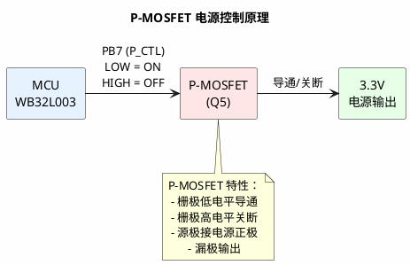
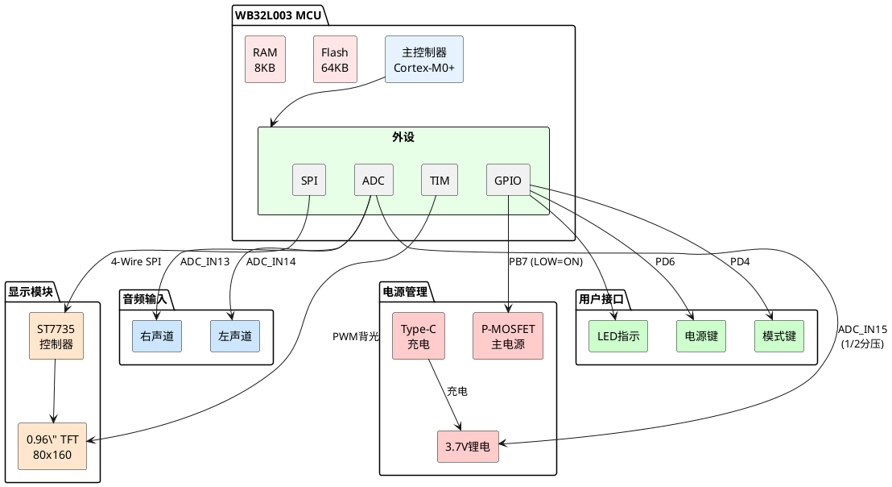
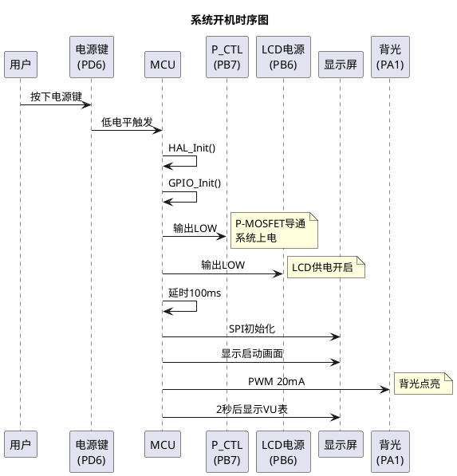
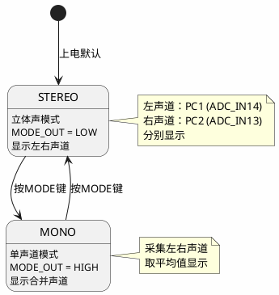

# WB32L003 耳放项目硬件对接技术文档

> 版本：v2.2  
> 日期：2025-07-31  
> 目的：与硬件工程师洪哥对接，确认硬件设计与软件实现的一致性

## 一、项目背景与需求

### 1.1 项目概述
本项目是一个基于 WB32L003 MCU 的高端耳机放大器，主要功能包括：
- 双声道音频电平实时显示（VU表）
- STEREO/MONO 模式切换
- 0.96寸 TFT 彩屏显示
- USB Type-C 充电
- 低功耗设计

### 1.2 核心需求
1. **显示功能**
   - 开机显示启动画面（2秒）
   - 主界面显示 VU 表动画
   - 电池电量指示
   - 充电状态显示

2. **音频功能**
   - 支持立体声（STEREO）和单声道（MONO）模式
   - 实时采集左右声道音频电平
   - 音频静音控制

3. **电源管理**
   - 软开关机功能
   - 低电量警告（3.0V）
   - 自动关机保护（2.8V）
   - USB充电检测

## 二、硬件配置与引脚映射

### 2.1 MCU 基本信息
- **型号**：WB32L003K8U6 (QFN32封装)
- **内核**：ARM Cortex-M0+ @ 48MHz
- **Flash**：64KB (地址：0x00000000 - 0x0000FFFF)
- **RAM**：8KB
- **供电**：3.3V

### 2.2 完整引脚映射表

| MCU引脚 | 功能名称 | 方向 | 说明 | 电气特性 |
|---------|----------|------|------|----------|
| **SPI接口（TFT显示屏）** |||||
| PC5 | SPI_SCK | OUT | SPI时钟 | 3.3V, 高速 |
| PC6 | SPI_MOSI | OUT | SPI数据输出 | 3.3V, 高速 |
| PC0 | TFT_CS | OUT | 片选信号 | 3.3V, 低电平有效 |
| PA3 | TFT_DC | OUT | 数据/命令选择 | 3.3V |
| PD3 | TFT_RST | OUT | 硬件复位 | 3.3V, 低电平有效 |
| PA1 | TFT_BL | OUT | 背光PWM控制 | TIM2_CH2, 20mA max |
| **ADC输入** |||||
| PC0 | BAT_ADC | IN | 电池电压检测 | ADC_IN15, 1/2分压 |
| PC1 | L_AD | IN | 左声道音频 | ADC_IN14 |
| PC2 | R_AD | IN | 右声道音频 | ADC_IN13 |
| **用户接口** |||||
| PD6 | KEY_PWR | IN | 电源按键 | 上拉，低电平有效 |
| PD4 | KEY_MODE | IN | 模式切换按键 | 上拉，低电平有效 |
| **LED指示灯** |||||
| PB0 | LED_RED | OUT | 红色LED | 低电平点亮 |
| PB2 | LED_GREEN | OUT | 绿色LED | 低电平点亮 |
| **音频控制** |||||
| PA4 | MUTE | OUT | 静音控制 | 高电平=解除静音 |
| PB2 | MODE_OUT | OUT | 模式输出 | 高电平=MONO |
| **电源管理** |||||
| PB7 | P_CTL | OUT | 主电源控制 | **低电平=开启电源** (P-MOSFET) |
| PB6 | CON_LCD | OUT | LCD电源控制 | **低电平=开启电源** (P-MOSFET) |
| **其他** |||||
| PB5 | CHRG | IN | 充电检测 | 低电平=充电中 |

### 2.3 引脚冲突说明
⚠️ **注意**：PB6 存在功能冲突
- 当前分配给 CON_LCD（LCD电源控制）
- 之前也分配给 V2_PIN（STEREO/MONO选择）
- 需要硬件确认实际使用哪个功能

## 三、关键硬件实现细节

### 3.1 电源控制电路（重要）



**关键代码实现**：
```c
void HW_SetMainPower(bool enable)
{
    // P-MOSFET control: LOW = Power ON, HIGH = Power OFF
    HAL_GPIO_WritePin(CON_POW_PORT, CON_POW_PIN, enable ? GPIO_PIN_RESET : GPIO_PIN_SET);
}
```

### 3.2 系统架构图



### 3.3 开机时序



### 3.4 音频模式状态机



## 四、软件实现要点

### 4.1 初始化顺序
1. HAL_Init() - HAL库初始化
2. SystemClock_Config() - 时钟配置（48MHz）
3. GPIO_Init() - GPIO初始化
4. **立即设置 P_CTL=LOW** - 确保系统供电
5. 延时100ms - 等待电源稳定
6. SPI_Init() - SPI接口初始化
7. ADC_Init() - ADC初始化
8. TIM_Init() - 定时器初始化

### 4.2 ADC配置
- **采样率**：1kHz（每毫秒采样一次）
- **分辨率**：12位
- **电压计算**：
  - 电池电压 = ADC值 × 3.3V ÷ 4096 × 2（因为1/2分压）
  - 音频电平 = ADC值 × 100 ÷ 4096（转换为0-100范围）

### 4.3 显示刷新
- **帧率**：30 FPS
- **VU表更新**：使用滑动平均算法平滑显示
- **背光控制**：PWM频率1kHz，占空比调节亮度

## 五、需要硬件确认的问题

### 5.1 引脚分配确认
1. **PB6 功能冲突**
   - 当前代码中同时定义为 CON_LCD 和 V2_PIN
   - 请确认实际硬件连接

2. **PD3 (TFT_RST)**
   - HAL库可能不支持GPIOD
   - 是否需要改用其他引脚？

3. **调试接口**
   - 是否预留了SWD调试接口？
   - 引脚：SWDIO, SWCLK

### 5.2 电气参数确认
1. **P-MOSFET型号**
   - 确认Q5的具体型号
   - 确认栅极阈值电压

2. **ADC输入保护**
   - 音频输入是否有保护电路？
   - 最大输入电压范围？

3. **背光电流**
   - 当前设置20mA，是否合适？
   - 最大允许电流？

### 5.3 机械结构
1. **按键类型**
   - 轻触开关还是自锁开关？
   - 是否需要软件消抖？

2. **LED位置**
   - 红绿LED的实际安装位置
   - 是否可见？

## 六、测试要点

### 6.1 电源测试
- [ ] P_CTL输出LOW时，系统3.3V正常
- [ ] P_CTL输出HIGH时，系统断电
- [ ] 电池电压ADC读数准确

### 6.2 显示测试
- [ ] SPI通信正常（CS、DC、SCK、MOSI信号）
- [ ] 启动画面显示2秒
- [ ] VU表动画流畅

### 6.3 音频测试
- [ ] 左右声道ADC采样正常
- [ ] STEREO/MONO切换正常
- [ ] 静音功能正常

### 6.4 按键测试
- [ ] 电源键短按响应
- [ ] 电源键长按3秒关机
- [ ] MODE键切换音频模式

## 七、附录

### 7.1 编译环境
- 工具链：arm-none-eabi-gcc 15.1.0
- 构建系统：Makefile
- HAL库：WB32L003 HAL Driver

### 7.2 固件信息
- 当前版本：v2.2
- 固件大小：64,580 bytes / 65,536 bytes (98.5%)
- 优化版本：13,800 bytes（使用简化UI）

### 7.3 烧录工具
- WB-Link PRO Configurator v1.0.15
- 烧录地址：0x00000000（注意不是STM32的0x08000000）

---

**文档维护**：如有硬件修改，请及时更新本文档并通知软件开发人员。