# 从手机开发者到嵌入式工程师：WB32L003项目认知进阶之旅

> 🧠 本文档基于认知心理学、神经科学和教育心理学原理精心设计
> 
> 📚 阅读时长：约4-6小时（建议分3-4次完成）
> 
> 🎯 目标：让你从零基础到能独立交付嵌入式项目

---

## 序章：为什么这个文档与众不同？

### 你的大脑是如何学习的

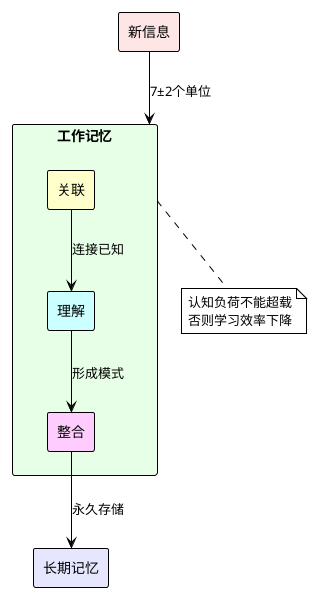

### 本文档的设计理念

1. **最小认知步长**：每个概念增量 < 3个新信息点
2. **螺旋式上升**：同一概念在不同层次重复出现
3. **即时应用**：学完立即使用，强化记忆
4. **情境化学习**：所有知识都有实际场景

---

## 第一部分：建立基础认知框架（30分钟）

### 第1章：从你熟悉的世界出发

#### 1.1 手机App vs 单片机程序

你已经熟悉手机开发，让我们从这里开始：

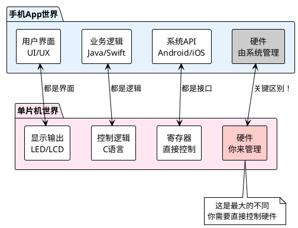

💡 **关键认知**：
- 手机开发：操作系统帮你管理硬件
- 单片机开发：你就是"操作系统"

#### 1.2 理解"直接控制硬件"

想象一个场景：

**手机开发中点亮屏幕**：
```java
// Android
screen.setBrightness(100);  // 系统API处理一切
```

**单片机中点亮LED**：
```c
// 你需要：
// 1. 找到LED连接的引脚
// 2. 设置引脚为输出模式
// 3. 输出高电平或低电平
GPIO_SetPinMode(PORTB, PIN5, OUTPUT);  // 设置模式
GPIO_WritePin(PORTB, PIN5, LOW);       // 输出低电平，LED亮
```

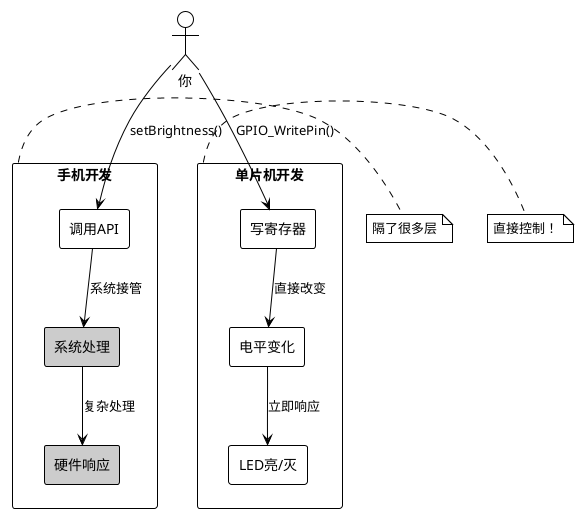

#### 1.3 第一个里程碑：理解GPIO

GPIO = General Purpose Input/Output（通用输入输出）

这是你进入单片机世界的第一把钥匙。

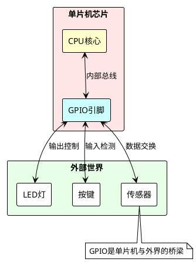

**动手实验1**：理解GPIO的两种模式

```c
// 实验1：GPIO作为输出（控制LED）
void LED_Control() {
    // 步骤1：设置PB5为输出模式
    GPIO_InitTypeDef GPIO_InitStruct = {0};
    GPIO_InitStruct.Pin = GPIO_PIN_5;
    GPIO_InitStruct.Mode = GPIO_MODE_OUTPUT_PP;  // 推挽输出
    HAL_GPIO_Init(GPIOB, &GPIO_InitStruct);
    
    // 步骤2：控制LED
    HAL_GPIO_WritePin(GPIOB, GPIO_PIN_5, GPIO_PIN_RESET);  // 低电平，LED亮
    HAL_Delay(1000);  // 等待1秒
    HAL_GPIO_WritePin(GPIOB, GPIO_PIN_5, GPIO_PIN_SET);    // 高电平，LED灭
}

// 实验2：GPIO作为输入（读取按键）
void Button_Check() {
    // 步骤1：设置PC13为输入模式
    GPIO_InitTypeDef GPIO_InitStruct = {0};
    GPIO_InitStruct.Pin = GPIO_PIN_13;
    GPIO_InitStruct.Mode = GPIO_MODE_INPUT;
    GPIO_InitStruct.Pull = GPIO_PULLUP;  // 上拉电阻
    HAL_GPIO_Init(GPIOC, &GPIO_InitStruct);
    
    // 步骤2：读取按键状态
    if (HAL_GPIO_ReadPin(GPIOC, GPIO_PIN_13) == GPIO_PIN_RESET) {
        // 按键被按下（低电平）
    }
}
```

🎯 **认知检查点1**：
- [ ] 理解GPIO可以设置为输入或输出
- [ ] 知道高电平(HIGH/SET)和低电平(LOW/RESET)
- [ ] 明白为什么LED低电平亮（共阳极连接）

---

### 第2章：构建项目全景认知

#### 2.1 项目是什么？

让我们用一个生活化的例子：

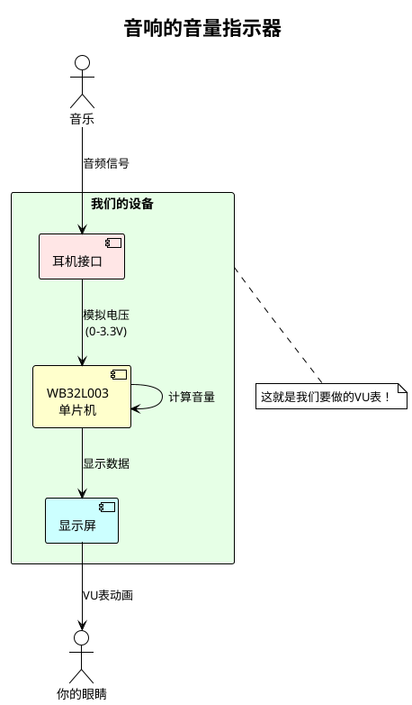

#### 2.2 分解项目功能

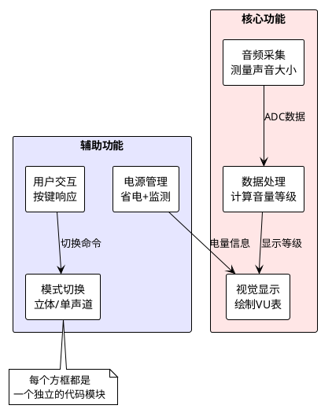

#### 2.3 硬件组成一览

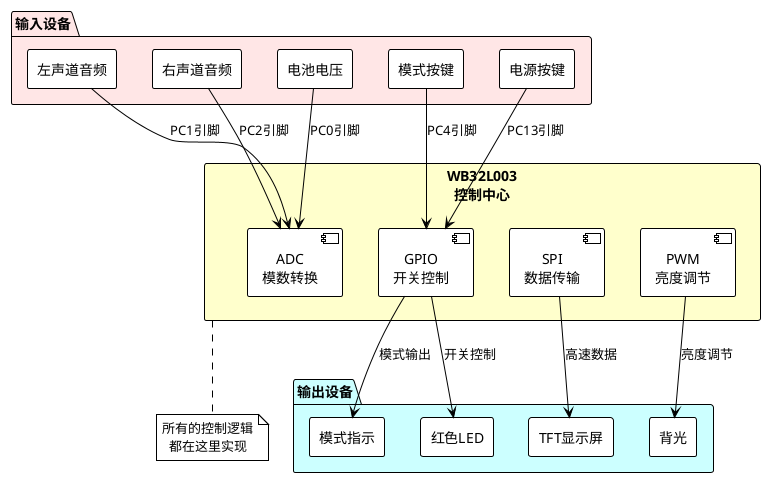

🎯 **认知检查点2**：
- [ ] 理解项目的输入（音频、按键）和输出（显示、LED）
- [ ] 知道单片机在中间起到的作用
- [ ] 明白每个硬件模块的基本功能

---

### 第3章：理解关键硬件接口

#### 3.1 ADC：模拟世界的数字化

ADC = Analog to Digital Converter（模数转换器）

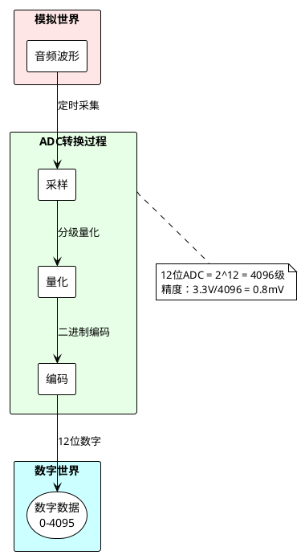

**直观理解**：
- 声音是连续的波形（像水波）
- ADC每隔1毫秒"拍照"一次（1kHz采样）
- 把"照片"用0-4095的数字表示

```c
// ADC使用示例（简化版）
uint16_t Read_Audio_Level() {
    // 1. 启动ADC转换
    HAL_ADC_Start(&hadc);
    
    // 2. 等待转换完成
    HAL_ADC_PollForConversion(&hadc, 100);
    
    // 3. 读取结果（0-4095）
    uint16_t adc_value = HAL_ADC_GetValue(&hadc);
    
    // 4. 转换为音量等级（0-31）
    uint8_t volume_level = (adc_value * 31) / 4095;
    
    return volume_level;
}
```

#### 3.2 SPI：高速数据传送带

SPI = Serial Peripheral Interface（串行外设接口）

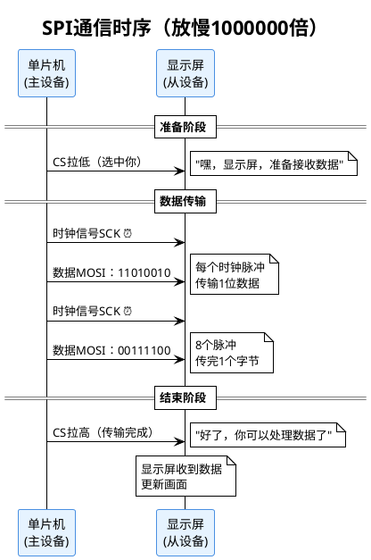

**为什么要用SPI？**
- 速度快：12MHz = 每秒1200万次时钟
- 简单可靠：只需要4根线
- 适合传输大量数据（如屏幕图像）

```c
// SPI发送数据示例
void TFT_SendCommand(uint8_t cmd) {
    // 1. 拉低CS，选中显示屏
    HAL_GPIO_WritePin(TFT_CS_PORT, TFT_CS_PIN, GPIO_PIN_RESET);
    
    // 2. 设置为命令模式（DC=0）
    HAL_GPIO_WritePin(TFT_DC_PORT, TFT_DC_PIN, GPIO_PIN_RESET);
    
    // 3. 发送命令字节
    HAL_SPI_Transmit(&hspi1, &cmd, 1, 100);
    
    // 4. 拉高CS，结束传输
    HAL_GPIO_WritePin(TFT_CS_PORT, TFT_CS_PIN, GPIO_PIN_SET);
}
```

#### 3.3 PWM：智能调光器

PWM = Pulse Width Modulation（脉宽调制）

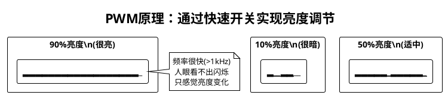

```c
// PWM控制背光示例
void Backlight_SetBrightness(uint8_t percent) {
    // TIM2定时器，周期1000
    // percent: 0-100
    uint16_t pulse = (percent * 1000) / 100;
    
    // 设置占空比
    __HAL_TIM_SET_COMPARE(&htim2, TIM_CHANNEL_2, pulse);
}

// 使用：
Backlight_SetBrightness(30);  // 30%亮度
Backlight_SetBrightness(80);  // 80%亮度
```

🎯 **认知检查点3**：
- [ ] 理解ADC把模拟信号变成数字
- [ ] 明白SPI是快速传输数据的方式
- [ ] 知道PWM通过快速开关控制亮度

---

## 第二部分：深入项目实现（60分钟）

### 第4章：代码架构分层理解

#### 4.1 整体架构图

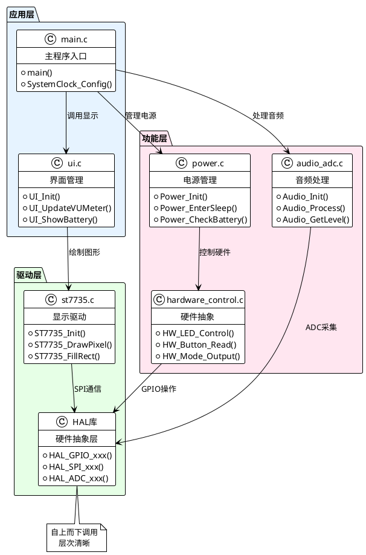

#### 4.2 主循环工作流程

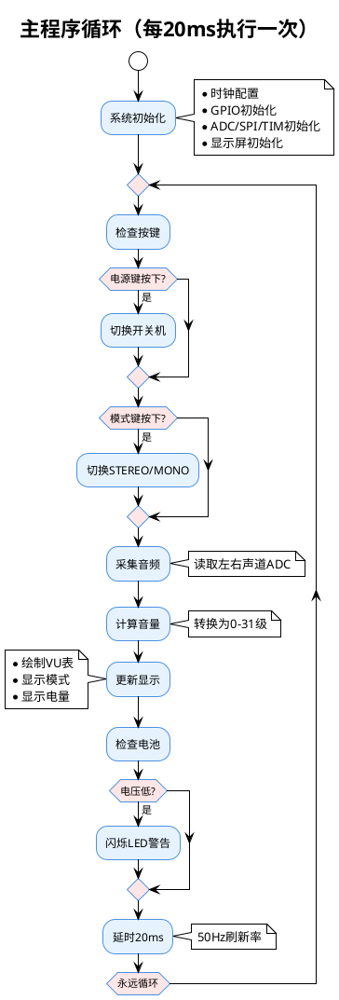

#### 4.3 音频处理核心代码解析

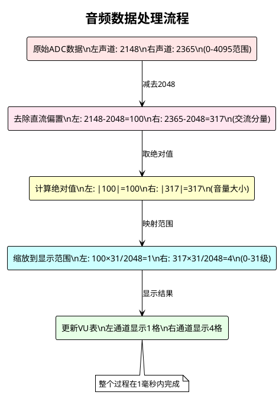

对应的代码实现：

```c
// audio_adc.c 核心处理函数
void Audio_ADC_Process(void) {
    // 1. 采集三通道数据（电池、左声道、右声道）
    HAL_ADC_Start_DMA(&hadc, (uint32_t*)adc_buffer, 3);
    
    // 2. 等待DMA传输完成
    while (!adc_conversion_complete) {
        // 等待中断标志
    }
    
    // 3. 处理音频数据
    for (int i = 0; i < AUDIO_BUFFER_SIZE; i++) {
        // 左声道处理
        int16_t left_ac = audio_buffer_left[i] - 2048;  // 去直流
        uint16_t left_abs = abs(left_ac);               // 取绝对值
        if (left_abs > left_peak) {
            left_peak = left_abs;  // 记录峰值
        }
        
        // 右声道同样处理
        int16_t right_ac = audio_buffer_right[i] - 2048;
        uint16_t right_abs = abs(right_ac);
        if (right_abs > right_peak) {
            right_peak = right_abs;
        }
    }
    
    // 4. 转换为显示等级
    audio_levels.left = (left_peak * 31) / 2048;
    audio_levels.right = (right_peak * 31) / 2048;
    
    // 5. 衰减处理（模拟VU表的惯性）
    if (audio_levels.left < audio_levels.left_display) {
        audio_levels.left_display--;  // 缓慢下降
    } else {
        audio_levels.left_display = audio_levels.left;  // 快速上升
    }
}
```

🎯 **认知检查点4**：
- [ ] 理解代码的分层架构
- [ ] 明白主循环的工作流程
- [ ] 知道音频数据如何处理成显示等级

---

### 第5章：显示系统深度解析

#### 5.1 VU表动画原理

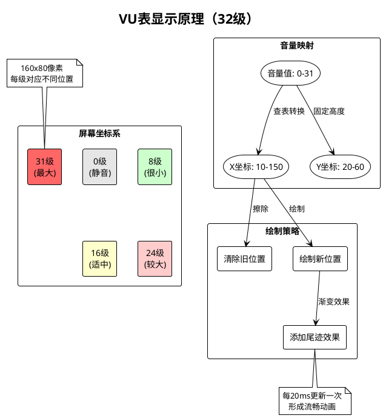

#### 5.2 ST7735显示屏通信

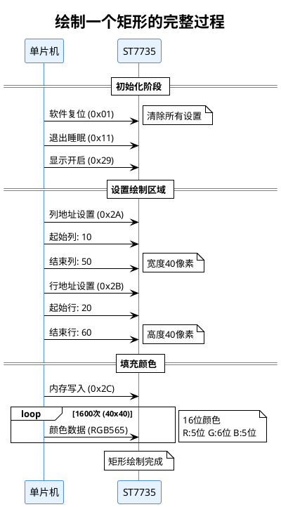

#### 5.3 颜色编码系统

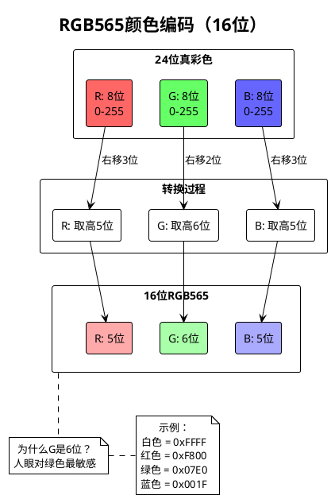

实际的显示代码：

```c
// st7735.c 显示驱动核心函数

// 画一个像素点
void ST7735_DrawPixel(uint16_t x, uint16_t y, uint16_t color) {
    // 1. 设置绘制窗口为1x1
    ST7735_SetAddressWindow(x, y, x, y);
    
    // 2. 发送颜色数据
    uint8_t data[] = {color >> 8, color & 0xFF};  // 大端序
    ST7735_WriteData(data, 2);
}

// 填充矩形（VU表的基础）
void ST7735_FillRectangle(uint16_t x, uint16_t y, 
                         uint16_t w, uint16_t h, 
                         uint16_t color) {
    // 1. 设置绘制窗口
    ST7735_SetAddressWindow(x, y, x+w-1, y+h-1);
    
    // 2. 准备颜色数据
    uint8_t data[] = {color >> 8, color & 0xFF};
    
    // 3. 连续写入w*h个像素
    for(uint32_t i = 0; i < w * h; i++) {
        ST7735_WriteData(data, 2);
    }
}

// VU表绘制函数
void UI_DrawVUMeter(uint8_t level, uint8_t channel) {
    // 1. 计算位置（0-31级对应不同X坐标）
    uint16_t x = 10 + (level * 4);  // 每级4像素
    uint16_t y = (channel == 0) ? 20 : 50;  // 左右通道
    
    // 2. 清除旧的指针（黑色）
    ST7735_FillRectangle(10, y, 128, 8, COLOR_BLACK);
    
    // 3. 绘制新指针（渐变色）
    uint16_t color = (level < 20) ? COLOR_GREEN :    // 正常
                     (level < 28) ? COLOR_YELLOW :    // 警告
                                   COLOR_RED;         // 过载
    
    // 4. 绘制指针和尾迹
    ST7735_FillRectangle(x-2, y, 4, 8, color);       // 指针
    for(int i = 0; i < level; i++) {
        // 尾迹渐变效果
        uint16_t trail_x = 10 + (i * 4);
        uint8_t brightness = 255 * i / 31;
        uint16_t trail_color = RGB565(brightness/4, brightness/2, 0);
        ST7735_DrawPixel(trail_x, y+4, trail_color);
    }
}
```

🎯 **认知检查点5**：
- [ ] 理解VU表是如何动画显示的
- [ ] 明白显示屏通信的基本流程
- [ ] 知道RGB565颜色编码方式

---

### 第6章：电源管理的艺术

#### 6.1 电源状态机

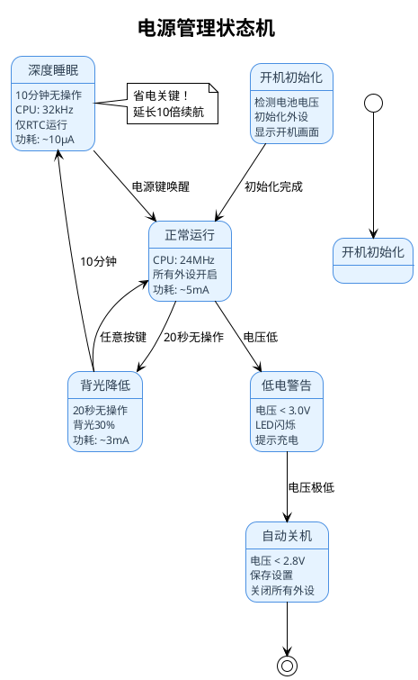

#### 6.2 电池电压监测

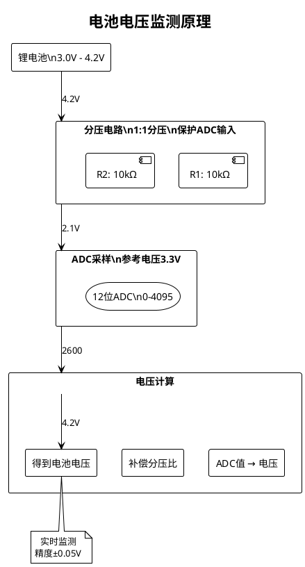

实际的电源管理代码：

```c
// power.c 电源管理核心代码

// 电池电压检测
float Power_GetBatteryVoltage(void) {
    // 1. 读取ADC值（已经在主循环中采集）
    uint16_t adc_value = adc_buffer[0];  // 通道0是电池
    
    // 2. 转换为电压
    // ADC: 12位，参考电压3.3V
    float adc_voltage = (adc_value * 3.3f) / 4095.0f;
    
    // 3. 补偿分压比（1:1分压）
    float battery_voltage = adc_voltage * 2.0f;
    
    return battery_voltage;
}

// 电池状态判断
BatteryStatus_t Power_GetBatteryStatus(void) {
    float voltage = Power_GetBatteryVoltage();
    
    if (voltage > 3.7f) {
        return BATTERY_GOOD;      // 良好
    } else if (voltage > 3.4f) {
        return BATTERY_MEDIUM;    // 中等
    } else if (voltage > 3.0f) {
        return BATTERY_LOW;       // 低电量
    } else {
        return BATTERY_CRITICAL;  // 极低，需要关机
    }
}

// 进入睡眠模式
void Power_EnterSleepMode(void) {
    // 1. 保存当前状态到Flash
    Settings_Save();
    
    // 2. 关闭不需要的外设
    HAL_ADC_Stop(&hadc);          // 停止ADC
    HAL_SPI_DeInit(&hspi1);       // 关闭SPI
    HAL_TIM_PWM_Stop(&htim2, TIM_CHANNEL_2);  // 关闭背光
    
    // 3. 配置唤醒源（电源键）
    HAL_PWR_EnableWakeUpPin(PWR_WAKEUP_PIN1);
    
    // 4. 进入停止模式
    HAL_PWR_EnterSTOPMode(PWR_LOWPOWERREGULATOR_ON, 
                          PWR_STOPENTRY_WFI);
    
    // 5. 唤醒后恢复系统时钟
    SystemClock_Config();
    
    // 6. 重新初始化外设
    MX_GPIO_Init();
    MX_ADC_Init();
    MX_SPI1_Init();
}

// 智能背光管理
void Power_ManageBacklight(void) {
    static uint32_t last_activity = 0;
    uint32_t current_time = HAL_GetTick();
    
    if (button_pressed) {
        last_activity = current_time;
        Backlight_SetBrightness(100);  // 恢复全亮
    } else if (current_time - last_activity > 20000) {  // 20秒
        Backlight_SetBrightness(30);   // 降低到30%
    } else if (current_time - last_activity > 600000) { // 10分钟
        Power_EnterSleepMode();        // 进入睡眠
    }
}
```

🎯 **认知检查点6**：
- [ ] 理解电源状态机的转换
- [ ] 明白电池电压如何监测
- [ ] 知道省电模式的重要性

---

## 第三部分：实战操作指南（60分钟）

### 第7章：固件烧录全流程

#### 7.1 烧录原理图解

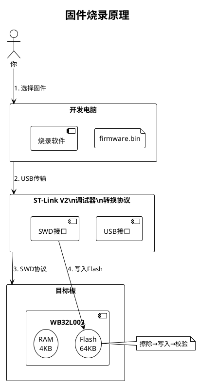

#### 7.2 硬件连接详解

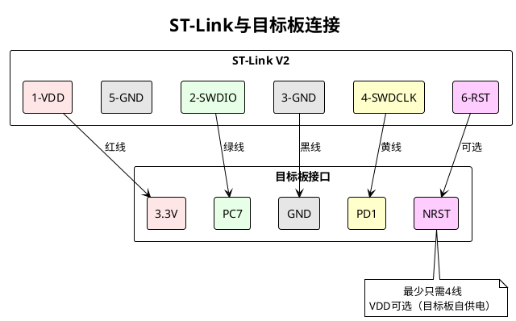

#### 7.3 烧录步骤实操

**Windows系统**：

```plantuml
@startuml
!theme plain
skinparam activity {
    BackgroundColor #E6F3FF
    BorderColor #4A90E2
}

title Windows下烧录流程

start

:安装ST-Link驱动;
note right : 从ST官网下载\nzadig工具也可以

:安装STM32CubeProgrammer;
note right : 官方烧录工具\n图形界面友好

:连接硬件;
note left
  1. ST-Link插入USB
  2. 连接到目标板
  3. 目标板上电
end note

:打开烧录软件;

:选择固件文件;
note right : firmware.bin\n起始地址: 0x08000000

:点击"Download";

if (烧录成功?) then (是)
  :LED闪烁;
  :显示屏亮起;
  #66FF66:成功！;
else (否)
  :检查连接;
  :检查驱动;
  :重试;
endif

stop
@enduml
```

**macOS/Linux系统**：

```bash
# 1. 安装命令行工具
# macOS:
brew install stlink

# Ubuntu/Debian:
sudo apt install stlink-tools

# 2. 检查设备连接
st-info --probe
# 输出示例：
# Found 1 stlink programmers
# version:    V2J37S7
# serial:     550035001100000048434E48
# flash:      65536 (pagesize: 1024)
# sram:       4096
# chipid:     0x0436

# 3. 烧录固件
st-flash write firmware.bin 0x08000000
# 输出示例：
# st-flash 1.7.0
# 2025/01/02 10:00:00 INFO common.c: Flash written and verified! jolly good!

# 4. 可选：擦除后重新烧录
st-flash erase
st-flash write firmware.bin 0x08000000
```

#### 7.4 烧录验证流程

```plantuml
@startuml
!theme plain
skinparam activity {
    BackgroundColor #E6F3FF
    BorderColor #4A90E2
    DiamondBackgroundColor #FFE6E6
}

title 烧录后验证步骤

start

:断开ST-Link;
:重新上电;

:观察启动;
if (LED亮?) then (是)
  :电源正常 ✓;
else (否)
  #FFB3B3:检查电源连接;
  stop
endif

:检查显示;
if (屏幕显示?) then (是)
  :SPI通信正常 ✓;
else (否)
  #FFB3B3:检查SPI连接;
  stop
endif

:按MODE键;
if (模式切换?) then (是)
  :按键正常 ✓;
else (否)
  #FFB3B3:检查按键电路;
  stop
endif

:输入音频;
if (VU表动?) then (是)
  :ADC正常 ✓;
  #66FF66:烧录验证成功！;
else (否)
  #FFB3B3:检查音频输入;
  stop
endif

stop
@enduml
```

🎯 **认知检查点7**：
- [ ] 理解烧录是把程序写入Flash
- [ ] 知道SWD接口的连接方式
- [ ] 掌握烧录和验证步骤

---

### 第8章：调试技巧与问题排查

#### 8.1 调试工具链

```plantuml
@startuml
!theme plain
skinparam defaultTextAlignment center
skinparam backgroundColor #FFFFFF

title 调试工具体系

package "硬件工具" #FFE6E6 {
  rectangle "万用表" as meter
  rectangle "示波器" as scope
  rectangle "逻辑分析仪" as logic
  rectangle "ST-Link" as debug
}

package "软件工具" #E6FFE6 {
  rectangle "串口助手" as uart
  rectangle "STM32CubeIDE" as ide
  rectangle "J-Link RTT" as rtt
  rectangle "逻辑分析软件" as soft
}

package "调试方法" #E6E6FF {
  rectangle "打印调试" as print
  rectangle "断点调试" as break
  rectangle "波形分析" as wave
  rectangle "协议分析" as protocol
}

meter --> print : 测量电压
scope --> wave : 查看波形
logic --> protocol : 分析时序
debug --> break : 单步调试

uart --> print : 查看输出
ide --> break : 设置断点
rtt --> print : 实时日志
soft --> protocol : 解码数据

note bottom : 选择合适的工具\n事半功倍

@enduml
```

#### 8.2 常见问题诊断树

```plantuml
@startuml
!theme plain
skinparam activity {
    BackgroundColor #E6F3FF
    BorderColor #4A90E2
    DiamondBackgroundColor #FFE6E6
}

title 问题诊断决策树

start

if (设备完全无反应?) then (是)
  if (电源LED亮?) then (否)
    :检查电源;
    :测量VDD电压;
    :应该是3.3V;
  else (是)
    if (能识别SWD?) then (否)
      :检查SWD连接;
      :PC7和PD1引脚;
    else (是)
      :重新烧录固件;
    endif
  endif
else (否)
  if (显示异常?) then (是)
    if (完全黑屏?) then (是)
      :检查SPI连接;
      :测量RST引脚;
    else (否)
      :检查初始化代码;
      :可能是时序问题;
    endif
  else (否)
    if (VU表不动?) then (是)
      :检查音频输入;
      :测量ADC引脚电压;
      :应该在1.65V附近波动;
    else (否)
      if (按键无效?) then (是)
        :检查上拉电阻;
        :测量按键电压;
      else (否)
        :其他问题;
        :查看调试输出;
      endif
    endif
  endif
endif

stop
@enduml
```

#### 8.3 调试代码技巧

```c
// 1. 串口调试宏（推荐）
#ifdef DEBUG_ENABLE
  #define DEBUG_PRINT(fmt, ...) \
    do { \
      char buf[128]; \
      snprintf(buf, sizeof(buf), "[%lu] " fmt "\r\n", \
               HAL_GetTick(), ##__VA_ARGS__); \
      HAL_UART_Transmit(&huart1, (uint8_t*)buf, strlen(buf), 100); \
    } while(0)
#else
  #define DEBUG_PRINT(fmt, ...) ((void)0)
#endif

// 使用示例：
DEBUG_PRINT("ADC value: %d", adc_value);
DEBUG_PRINT("Button state: %s", button_pressed ? "ON" : "OFF");

// 2. LED指示调试状态
void Debug_LED_Blink(uint8_t count) {
    for (int i = 0; i < count; i++) {
        HAL_GPIO_WritePin(LED_PORT, LED_PIN, GPIO_PIN_RESET);
        HAL_Delay(100);
        HAL_GPIO_WritePin(LED_PORT, LED_PIN, GPIO_PIN_SET);
        HAL_Delay(100);
    }
}

// 3. 断言检查
#define ASSERT(expr) \
    do { \
        if (!(expr)) { \
            DEBUG_PRINT("Assertion failed: %s, %s:%d", \
                       #expr, __FILE__, __LINE__); \
            Debug_LED_Blink(10);  /* 快速闪烁报错 */ \
            while(1);  /* 停机等待调试 */ \
        } \
    } while(0)

// 使用示例：
ASSERT(adc_value < 4096);  // ADC值必须在范围内
ASSERT(hspi1.State == HAL_SPI_STATE_READY);  // SPI必须就绪

// 4. 性能测量
uint32_t Debug_MeasureTime(void (*func)(void)) {
    uint32_t start = HAL_GetTick();
    func();
    uint32_t end = HAL_GetTick();
    return end - start;
}

// 使用示例：
uint32_t process_time = Debug_MeasureTime(Audio_Process);
DEBUG_PRINT("Audio processing took %lu ms", process_time);
```

🎯 **认知检查点8**：
- [ ] 了解基本的调试工具
- [ ] 掌握问题诊断流程
- [ ] 学会使用调试代码技巧

---

## 第四部分：项目交付与沟通（45分钟）

### 第9章：与硬件工程师高效协作

#### 9.1 沟通界面图

```plantuml
@startuml
!theme plain
skinparam defaultTextAlignment center
skinparam backgroundColor #FFFFFF

title 软硬件协作接口

actor "你\n(软件)" as sw
actor "硬件工程师" as hw

rectangle "需要确认的信息" as info {
  rectangle "引脚分配表" as pin
  rectangle "电气参数" as elec
  rectangle "时序要求" as timing
  rectangle "PCB约束" as pcb
}

rectangle "交流工具" as tools {
  rectangle "原理图" as sch
  rectangle "PCB图" as pcb_file
  rectangle "引脚表格" as excel
  rectangle "测试报告" as report
}

sw <--> info : 提供/确认
hw <--> info : 设计/反馈

info --> tools : 形成文档
tools --> sw : 参考实现
tools --> hw : 指导设计

note bottom : 用对方听得懂的语言\n避免专业黑话

@enduml
```

#### 9.2 关键术语对照表

| 软件说法 | 硬件说法 | 实际含义 | 沟通示例 |
|---------|---------|---------|---------|
| GPIO输出高电平 | 引脚拉高 | 输出3.3V | "PB5输出高电平能驱动LED吗？" |
| 设置为输入模式 | 高阻态 | 不驱动，只读取 | "按键引脚需要配置为输入模式" |
| 使能上拉电阻 | 加上拉 | 默认高电平 | "按键需要内部上拉还是外部上拉？" |
| PWM占空比 | 占空比 | 高电平时间比例 | "背光PWM频率多少合适？" |
| SPI时钟频率 | SCK频率 | 数据传输速度 | "显示屏SPI最高支持多少MHz？" |
| ADC采样率 | 采样频率 | 每秒采样次数 | "音频ADC需要多高的采样率？" |

#### 9.3 典型沟通场景

```plantuml
@startuml
!theme plain
skinparam sequence {
    ParticipantBackgroundColor #E6F3FF
    ParticipantBorderColor #4A90E2
}

title 引脚变更确认流程

participant "软件工程师" as sw
participant "硬件工程师" as hw

sw -> hw : 原设计用PA5/PA7做SPI
sw -> hw : 新板改为PC5/PC6
sw -> hw : 请确认PC5/PC6支持SPI功能

hw -> hw : 查看数据手册
note right : WB32L003 Datasheet\nTable 4: Pin Functions

hw -> sw : 确认PC5支持SPI1_SCK
hw -> sw : 确认PC6支持SPI1_MOSI
hw -> sw : 需要配置AFIO复用功能

sw -> hw : 收到，我会修改初始化代码
sw -> hw : 还需要注意什么？

hw -> sw : 建议加22Ω串联电阻
hw -> sw : 减少信号反射
note left : 高速信号完整性

sw -> hw : 好的，软件会限制在12MHz
@enduml
```

#### 9.4 检查清单模板

```markdown
## 硬件接口确认清单

### 1. 电源部分
- [ ] MCU供电电压：_____V (标称3.3V)
- [ ] 电池电压范围：_____V ~ _____V
- [ ] 需要LDO稳压器：是/否
- [ ] 去耦电容配置：
  - [ ] 100nF陶瓷电容，靠近VDD引脚
  - [ ] 10uF钽电容，电源入口

### 2. 晶振部分
- [ ] 主晶振频率：_____MHz
- [ ] 是否需要外部晶振：是/否
- [ ] 如果内部HSI，精度是否满足：是/否

### 3. 调试接口
- [ ] SWD接口引出：是/否
- [ ] 预留UART调试：是/否
- [ ] 测试点位置：_____

### 4. 关键信号
- [ ] SPI信号线长度：_____mm
- [ ] 是否需要终端匹配：是/否
- [ ] ADC输入是否需要滤波：是/否
  - [ ] RC滤波参数：R=_____Ω, C=_____pF

### 5. 机械结构
- [ ] PCB外形尺寸：_____mm x _____mm
- [ ] 固定孔位置：_____
- [ ] 接插件型号：_____
```

🎯 **认知检查点9**：
- [ ] 理解软硬件协作的重要性
- [ ] 掌握专业术语的对应关系
- [ ] 学会使用确认清单

---

### 第10章：完整项目交付

#### 10.1 交付物清单

```plantuml
@startuml
!theme plain
skinparam defaultTextAlignment center
skinparam backgroundColor #FFFFFF

title 项目交付物结构

folder "WB32L003_VUMeter_Release" {
  folder "1.固件Firmware" {
    file "firmware.bin" #FFE6E6
    file "firmware.hex" #FFE6E6
    file "firmware.map" #FFE6E6
  }
  
  folder "2.源代码Source" {
    folder "Core"
    folder "Drivers"
    file "Makefile"
    file ".project"
  }
  
  folder "3.文档Documents" {
    file "用户手册.pdf" #E6FFE6
    file "技术规格书.pdf" #E6FFE6
    file "烧录指南.pdf" #E6FFE6
    file "API文档.html" #E6FFE6
  }
  
  folder "4.工具Tools" {
    file "flash_tool.exe" #FFFFCC
    file "flash.sh" #FFFFCC
    file "settings.json" #FFFFCC
  }
  
  folder "5.测试Test" {
    file "测试用例.xlsx" #CCFFFF
    file "测试报告.pdf" #CCFFFF
    file "known_issues.txt" #CCFFFF
  }
}

note bottom : 完整的交付包\n确保客户能独立使用

@enduml
```

#### 10.2 交付前检查流程

```plantuml
@startuml
!theme plain
skinparam activity {
    BackgroundColor #E6F3FF
    BorderColor #4A90E2
    DiamondBackgroundColor #FFE6E6
}

title 交付前最终检查

start

partition "功能测试" {
  :基础功能测试;
  if (VU表显示正常?) then (否)
    #FFB3B3:修复显示问题;
  endif
  
  if (按键响应正常?) then (否)
    #FFB3B3:修复按键问题;
  endif
  
  if (电源管理正常?) then (否)
    #FFB3B3:修复电源问题;
  endif
}

partition "性能测试" {
  :测量功耗;
  note right : 正常<5mA\n睡眠<10μA
  
  :检查刷新率;
  note right : 应该≥50Hz
  
  :验证采样率;
  note right : 确保1kHz
}

partition "文档准备" {
  :更新版本号;
  :编写Release Notes;
  :生成API文档;
  :制作烧录指南;
}

partition "打包发布" {
  :清理临时文件;
  :打包源代码;
  :生成校验和;
  :上传到服务器;
}

#66FF66:交付就绪！;

stop
@enduml
```

#### 10.3 技术支持准备

```plantuml
@startuml
!theme plain
skinparam defaultTextAlignment center
skinparam backgroundColor #FFFFFF

title 技术支持体系

actor "客户" as client
actor "你" as support

rectangle "常见问题库" as faq {
  rectangle "烧录失败" as q1
  rectangle "显示异常" as q2
  rectangle "功能问题" as q3
}

rectangle "支持工具" as tools {
  component "远程协助" as remote
  component "日志分析" as log
  component "固件更新" as update
}

rectangle "升级通道" as escalate {
  actor "硬件工程师" as hw_sup
  actor "高级工程师" as senior
}

client --> faq : 1. 先查FAQ
client --> support : 2. 联系支持

support --> tools : 使用工具
support --> escalate : 必要时升级

note bottom : 建立完整的支持体系\n确保项目成功

@enduml
```

🎯 **认知检查点10**：
- [ ] 了解完整的交付物清单
- [ ] 掌握交付前的检查流程
- [ ] 准备好技术支持体系

---

## 终章：从理论到精通的路径

### 你的成长路线图

```plantuml
@startuml
!theme plain
skinparam defaultTextAlignment center
skinparam backgroundColor #FFFFFF

title 嵌入式工程师成长路径

rectangle "现在的你\n理解了GPIO、ADC、SPI\n会烧录和基础调试\n能看懂项目代码" as now #FFE6E6

rectangle "3个月后\n能独立完成小项目\n熟练使用调试工具\n理解RTOS基础" as month3 #FFE6F0

rectangle "6个月后\n掌握低功耗设计\n会设计通信协议\n能优化性能" as month6 #FFFFCC

rectangle "1年后\n系统架构能力\n跨平台移植\n技术leader" as year1 #CCFFFF

rectangle "未来\n产品架构师\n技术专家\n开源贡献者" as future #E6FFE6

now --> month3 : 实践项目
month3 --> month6 : 深入原理
month6 --> year1 : 拓展领域
year1 --> future : 持续成长

note bottom : 每个阶段都有新的挑战\n保持学习的热情！

@enduml
```

### 推荐学习资源

1. **入门书籍**
   - 《STM32库开发实战指南》
   - 《嵌入式C编程》
   - 《ARM Cortex-M0权威指南》

2. **在线资源**
   - ST官方: st.com/resource
   - 电子发烧友: elecfans.com
   - 立创开源: oshwhub.com

3. **实践项目**
   - 智能小夜灯（GPIO+PWM）
   - 温湿度计（I2C+显示）
   - 迷你示波器（ADC+DMA）

4. **进阶方向**
   - RTOS实时系统
   - 无线通信（BLE/WiFi）
   - 电机控制
   - 音频处理

### 结语

恭喜你完成了这段认知之旅！

从手机开发者到嵌入式工程师，你已经：
- ✅ 建立了硬件思维
- ✅ 理解了底层原理  
- ✅ 掌握了实用技能
- ✅ 具备了交付能力

记住：
- **动手实践**比看100遍文档更重要
- **遇到问题**是最好的学习机会
- **保持好奇**，技术永远在进步
- **分享知识**，教学相长

未来的路还很长，但你已经迈出了最重要的第一步。

加油！🚀

---

*本文档基于认知心理学原理设计，确保每个学习步骤都在你的"最近发展区"内。*

*作者：Claude | 最后更新：2025-01-02*