# WB32L003 耳放项目全景认知文档

> 📚 本文档专为移动端开发背景的读者设计，从零开始构建单片机项目的完整认知体系
> 
> 作者：Claude | 版本：v1.0 | 日期：2025-07-02

---

## 目录

1. [第一章：最小认知框架 - 10分钟快速入门](#第一章最小认知框架)
2. [第二章：系统架构 - 项目全景图](#第二章系统架构)
3. [第三章：核心概念 - 单片机的五大系统](#第三章核心概念)
4. [第四章：项目实现 - 代码如何工作](#第四章项目实现)
5. [第五章：实战操作 - 烧录与测试](#第五章实战操作)
6. [第六章：沟通指南 - 与硬件工程师协作](#第六章沟通指南)

---

## 第一章：最小认知框架

### 1.1 什么是单片机？

🎯 **一句话理解**：单片机就是一个"微型电脑"，可以接收信号、处理信息、控制设备。

🌍 **生活类比**：
想象一个智能遥控器：
- 你按下按钮（输入）
- 遥控器识别按钮（处理）
- 发出控制信号（输出）
- 电视执行命令（结果）

单片机就是这样的"智能控制中心"，只是它更加灵活和强大。

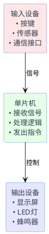

### 1.2 我们的项目在做什么？

🎯 **一句话理解**：做一个"音乐可视化器"，把声音的大小用灯光条显示出来。

🌍 **生活类比**：
就像汽车音响上的音量指示灯：
- 音乐响，灯就多亮几格
- 音乐轻，灯就少亮几格
- 左右声道分别显示

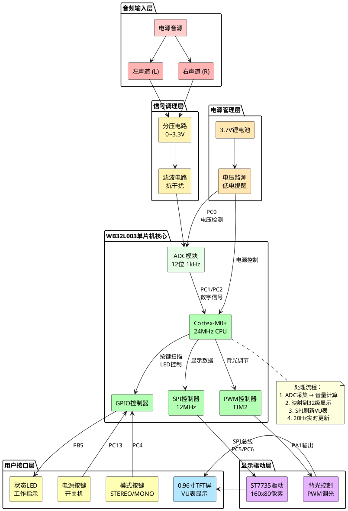

### 1.3 为什么需要单片机？

💡 **关键理解**：
- **实时性**：每秒采集1000次音频，人眼看到流畅动画
- **智能化**：自动调节背光、监测电池、切换模式
- **低功耗**：不工作时进入睡眠，延长电池寿命
- **可编程**：通过代码实现各种功能，灵活升级

---

## 第二章：系统架构

### 2.1 硬件架构全景

#### 系统概念图

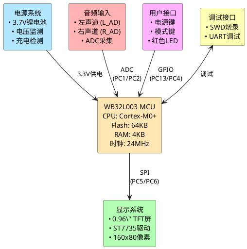

### 2.2 硬件连接概览

🎯 **理解重点**：各模块如何协同工作

💡 **工程思维**：
- **模块化设计**：每个部分都有明确职责
- **接口标准化**：SPI、GPIO等通用接口
- **信号流向清晰**：输入→处理→输出

### 2.3 系统信号流


### 2.4 软件架构分层

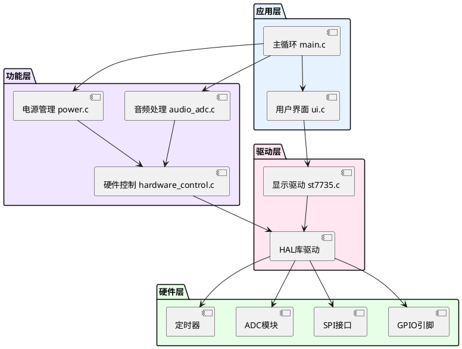

### 2.5 数据流向图

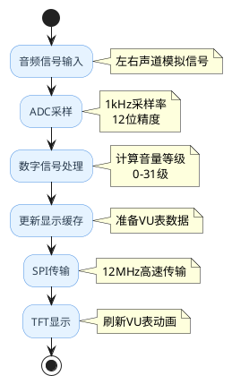

---

## 第三章：核心概念

### 3.1 GPIO - 单片机的手脚

🎯 **一句话理解**：GPIO就是单片机的"开关"，可以控制高低电平，也可以读取外部信号。

🌍 **生活类比**：
- **输出模式**：像家里的开关，可以控制灯的亮灭
- **输入模式**：像门铃按钮，可以检测是否被按下

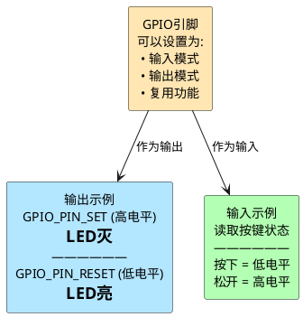

💡 **项目中的应用**：
```c
// 点亮红色LED（低电平有效）
HAL_GPIO_WritePin(LED_RED_PORT, LED_RED_PIN, GPIO_PIN_RESET);

// 读取电源按键状态
if (HAL_GPIO_ReadPin(KEY_PWR_PORT, KEY_PWR_PIN) == GPIO_PIN_RESET) {
    // 按键被按下
}
```

### 3.2 ADC - 模拟世界的翻译官

🎯 **一句话理解**：ADC把连续的模拟信号（如声音）转换成数字（如0-4095）。

🌍 **生活类比**：
像温度计的工作原理：
- 温度是连续变化的（模拟）
- 温度计显示具体数字（数字）
- 精度决定了能分辨多细微的变化

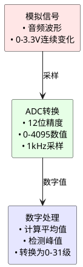

💡 **关键参数理解**：
- **12位精度**：能分辨 3.3V/4096 = 0.8mV 的变化
- **1kHz采样率**：每秒采集1000次，捕捉音频变化
- **3通道扫描**：同时采集电池、左声道、右声道

### 3.3 SPI - 高速数据传输

🎯 **一句话理解**：SPI是一种"传送带"，快速把数据从单片机送到显示屏。

🌍 **生活类比**：
像工厂的流水线：
- **SCK（时钟）**：传送带的速度
- **MOSI（数据）**：传送带上的货物
- **CS（片选）**：选择哪条流水线工作

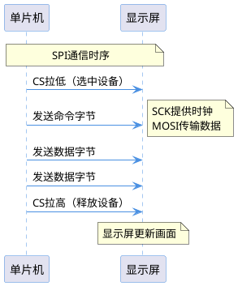

💡 **为什么用SPI？**
- **速度快**：12MHz，每秒传输150万字节
- **实时性**：保证动画流畅不卡顿
- **简单可靠**：只需要4根线

### 3.4 PWM - 亮度调节器

🎯 **一句话理解**：PWM通过快速开关来调节平均功率，实现亮度调节。

🌍 **生活类比**：
像电风扇的调速：
- 一直开 = 最大风速
- 开一会关一会 = 中等风速
- 开的时间很短 = 微风

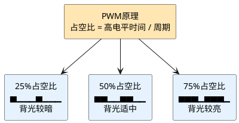

### 3.5 中断 - 紧急事件处理

🎯 **一句话理解**：中断就是"紧急电话"，可以立即打断正在做的事情。

🌍 **生活类比**：
你正在看书（主程序），突然：
- 电话响了（中断发生）
- 你放下书去接电话（执行中断程序）
- 接完电话继续看书（返回主程序）

---

## 第四章：项目实现

### 4.1 物理架构深入

#### 硬件分层结构

当你对系统有了基本理解后，我们来看看实际的物理架构：

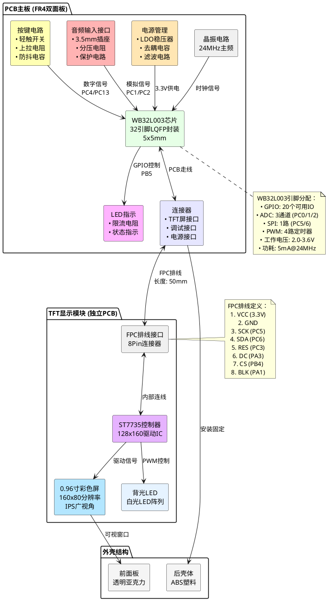

#### PCB与组件连接关系

理解了分层结构后，我们来看看实际的连接方式：

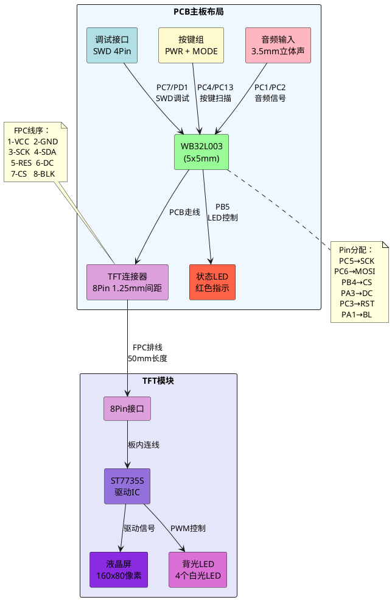

### 4.2 引脚分配详解

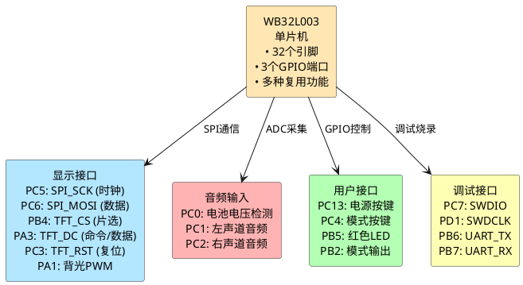

### 图解说明

1. **WB32L003单片机**：
   - **重要性**：这是整个系统的核心，负责处理所有输入和输出信号。
   - **原理**：通过其32个引脚和多种复用功能，可以灵活地连接外设并实现复杂的功能。

2. **显示接口**：
   - **PC5 (SPI_SCK)**：提供时钟信号，确保数据传输同步。
   - **PC6 (SPI_MOSI)**：传输显示数据。
   - **PB4 (TFT_CS)**：片选信号，用于选择显示屏。
   - **PA3 (TFT_DC)**：区分命令和数据。
   - **PC3 (TFT_RST)**：复位显示屏，确保初始化正常。
   - **PA1 (背光PWM)**：通过PWM调节屏幕亮度。
   - **重要性**：这些引脚共同实现显示屏的控制和数据更新。

3. **音频输入**：
   - **PC0 (电池电压检测)**：监测电池电压，提供低电量提醒。
   - **PC1 (左声道音频)** 和 **PC2 (右声道音频)**：采集音频信号，用于音量显示。
   - **重要性**：音频输入是项目的核心功能，直接影响显示效果。

4. **用户接口**：
   - **PC13 (电源按键)**：控制系统开关机。
   - **PC4 (模式按键)**：切换显示模式（如立体声/单声道）。
   - **PB5 (红色LED)**：指示系统状态。
   - **PB2 (模式输出)**：输出当前模式状态。
   - **重要性**：用户接口提供交互功能，提升用户体验。

5. **调试接口**：
   - **PC7 (SWDIO)** 和 **PD1 (SWDCLK)**：用于调试和烧录程序。
   - **PB6 (UART_TX)** 和 **PB7 (UART_RX)**：用于串口通信，输出调试信息。
   - **重要性**：调试接口是开发和测试阶段的关键，确保系统功能正常。

### 4.2 VU表显示原理

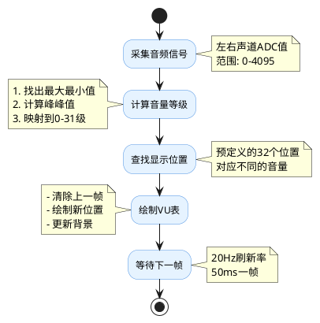

### 4.3 音频采集实现

```c
// 音频处理的核心逻辑（简化版）
void Audio_Process() {
    // 1. ADC采集原始数据
    uint16_t left_raw = ADC_GetValue(LEFT_CHANNEL);   // 0-4095
    uint16_t right_raw = ADC_GetValue(RIGHT_CHANNEL); // 0-4095
    
    // 2. 去除直流偏置（音频信号围绕2048变化）
    int16_t left_ac = left_raw - 2048;
    int16_t right_ac = right_raw - 2048;
    
    // 3. 计算音量（取绝对值）
    uint16_t left_level = abs(left_ac);
    uint16_t right_level = abs(right_ac);
    
    // 4. 映射到显示等级（0-31）
    uint8_t left_display = (left_level * 31) / 2048;
    uint8_t right_display = (right_level * 31) / 2048;
    
    // 5. 更新显示
    UI_UpdateVUMeter(left_display, right_display);
}
```

### 4.4 电源管理策略

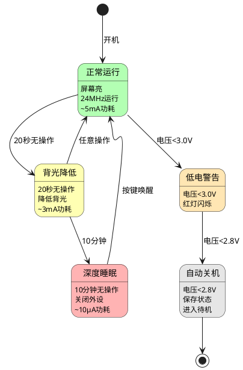

### 4.5 模式切换逻辑

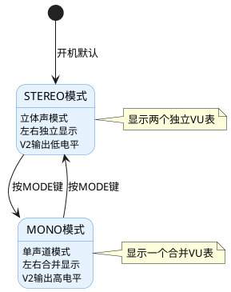

---

## 第五章：实战操作

### 5.1 固件烧录原理

🎯 **一句话理解**：烧录就是把程序"装进"单片机，像给手机装APP。

🌍 **生活类比**：
- 单片机 = 新手机
- 固件 = 操作系统+APP
- 烧录器 = 数据线
- 烧录 = 安装过程

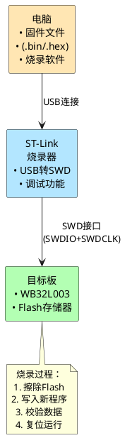

### 5.2 硬件连接方法

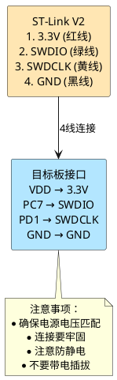

### 5.3 烧录步骤详解

#### Windows环境：

```bash
# 1. 安装ST-Link驱动
# 下载地址：st.com

# 2. 安装烧录工具
# STM32 ST-LINK Utility 或 STM32CubeProgrammer

# 3. 连接硬件
# ST-Link → 目标板

# 4. 烧录命令
st-flash write firmware.bin 0x08000000
```

#### macOS/Linux环境：

```bash
# 1. 安装烧录工具
brew install stlink  # macOS
sudo apt install stlink-tools  # Linux

# 2. 检查连接
st-info --probe

# 3. 烧录固件
st-flash write firmware.bin 0x08000000

# 4. 查看输出
# 2025-07-02T10:00:00 INFO common.c: Flash written and verified! jolly good!
```

### 5.4 烧录后的验证

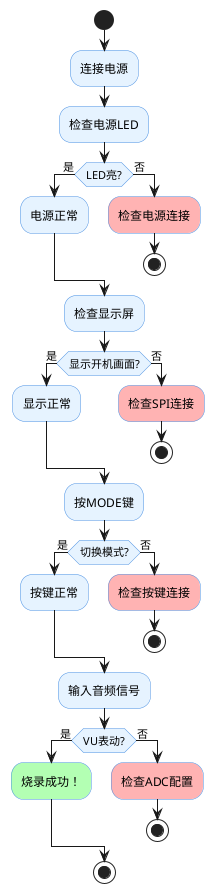

### 5.5 常见问题排查

| 问题现象 | 可能原因 | 解决方法 |
|---------|---------|---------|
| 无法识别设备 | 连接错误 | 检查SWDIO/SWDCLK |
| 烧录失败 | Flash被锁 | 先执行擦除命令 |
| 屏幕不亮 | SPI配置错误 | 检查引脚定义 |
| 按键无反应 | GPIO配置错误 | 检查上拉电阻 |
| VU表不动 | ADC未工作 | 检查时钟配置 |

---

## 第六章：沟通指南

### 6.1 硬件术语速查

| 术语 | 含义 | 沟通示例 |
|------|------|----------|
| 上拉/下拉 | 引脚默认电平 | "按键需要上拉电阻吗？" |
| 高/低有效 | 触发电平 | "LED是低电平点亮吗？" |
| 复用功能 | 引脚多用途 | "PC5可以用作SPI吗？" |
| 去耦电容 | 电源滤波 | "MCU电源需要去耦电容吗？" |
| 分压电阻 | 电压调整 | "电池检测的分压比是多少？" |

### 6.2 关键确认清单

与硬件工程师确认时，使用这个清单：

#### 🔌 电源部分
- **MCU供电电压：3.3V？**
  - 确认单片机的工作电压范围是否与设计一致，避免供电不足或过压损坏。
- **电池电压范围：2.8V-4.2V？**
  - 确认电池的工作范围，确保低电量时系统能正常工作，高电量时不会过充。
- **需要LDO稳压吗？**
  - 确认是否需要低压差稳压器来提供稳定的3.3V电源。
- **去耦电容的位置和容值？**
  - 确认去耦电容的安装位置和容量，确保电源噪声被有效滤除。

#### 📡 通信接口
- **SPI最高频率限制？**
  - 确认显示屏或其他外设是否支持设计的SPI时钟频率，避免信号失真。
- **需要上拉电阻的引脚？**
  - 确认哪些引脚需要上拉电阻以避免悬空状态，确保信号稳定。
- **信号线的长度限制？**
  - 确认PCB设计中信号线的长度是否会影响通信质量。
- **是否需要串联电阻？**
  - 确认是否需要在信号线上串联电阻以减少反射或干扰。

#### 🔊 模拟部分
- **音频输入的电压范围？**
  - 确认音频信号的电压范围是否与ADC的输入范围匹配。
- **需要输入保护吗？**
  - 确认是否需要保护电路（如二极管或电阻）来防止过压或反向电流。
- **ADC参考电压是多少？**
  - 确认ADC的参考电压是否稳定，确保采样精度。
- **是否需要滤波电路？**
  - 确认是否需要滤波电路来减少噪声干扰，提高信号质量。

#### 🎛️ 机械部分
- **按键的机械结构？**
  - 确认按键的类型（轻触开关、拨动开关等）是否符合设计要求。
- **是否有硬件消抖？**
  - 确认是否通过电容或RC电路实现按键消抖，避免误触发。
- **连接器的型号规格？**
  - 确认连接器的型号和规格是否与外设兼容。
- **PCB的层数和厚度？**
  - 确认PCB的设计是否满足机械和电气要求。

### 6.3 沟通模板示例

#### 询问引脚变更：
```
Hi，关于新版PCB的引脚分配：
1. 原设计SPI使用PA5/PA7，新版改为PC5/PC6
2. 请确认PC5/PC6支持SPI功能
3. 时钟频率要求：12MHz
4. 是否需要调整PCB走线？
```
- **备注**：此模板用于确认引脚变更是否影响功能实现，确保硬件设计与软件需求一致。

#### 报告问题：
```
发现问题：红色LED不亮
测试条件：PB5输出低电平
预期结果：LED点亮
实际结果：LED不亮
怀疑原因：
1. LED极性接反？
2. 限流电阻太大？
3. 引脚定义错误？
```
- **备注**：此模板用于报告硬件问题，明确测试条件和预期结果，便于硬件工程师快速定位问题。

#### 项目交接要点：
```
向硬件工程师交接时，提供：
1. 引脚分配表（Excel格式）
2. 电气参数要求
3. 时序要求说明
4. 测试用例清单
5. 已知限制说明
```
- **备注**：此模板用于项目交接，确保软硬件团队之间的信息传递清晰完整。

---

## 附录A：快速参考卡

### 引脚功能一览

| 功能分类 | 引脚 | 说明 |
|---------|------|------|
| **SPI显示** | PC5 | 时钟信号 |
| | PC6 | 数据信号 |
| | PB4 | 片选信号 |
| | PA3 | 数据/命令 |
| | PC3 | 复位信号 |
| **PWM背光** | PA1 | TIM2_CH2 |
| **ADC输入** | PC0 | 电池电压 |
| | PC1 | 左声道 |
| | PC2 | 右声道 |
| **用户按键** | PC13 | 电源键 |
| | PC4 | 模式键 |
| **指示灯** | PB5 | 红色LED |
| **调试** | PC7/PD1 | SWD接口 |

### 关键代码位置

| 功能 | 文件 | 主要函数 |
|------|------|----------|
| 主程序 | main.c | main() |
| 引脚定义 | pin_config.h | - |
| 显示驱动 | st7735.c | ST7735_Init() |
| 音频处理 | audio_adc.c | Audio_ADC_Process() |
| 电源管理 | power.c | Power_Process() |
| 界面更新 | ui.c | UI_UpdateVUMeter() |

### 调试命令速查

```bash
# 查看设备
st-info --probe

# 烧录程序
st-flash write firmware.bin 0x08000000

# 擦除Flash
st-flash erase

# 读取Flash
st-flash read output.bin 0x08000000 0x10000

# 复位设备
st-flash reset
```

---

## 附录B：进阶学习路径

### 🎯 如果你想深入了解单片机：

1. **基础知识**
   - 数字电路基础
   - C语言编程
   - 计算机组成原理

2. **进阶技能**
   - RTOS实时系统
   - 低功耗设计
   - EMC电磁兼容

3. **实践项目**
   - LED矩阵显示
   - 温度监控系统
   - 智能小车

### 📚 推荐资源：

- **书籍**：《STM32库开发实战指南》
- **网站**：ST官方文档中心
- **社区**：电子发烧友论坛
- **工具**：STM32CubeMX配置工具

---

## 结语

恭喜你！读到这里，你已经掌握了：

✅ 单片机的基本概念
✅ 项目的完整架构
✅ 关键技术的原理
✅ 实际操作的方法
✅ 与硬件工程师的沟通技巧

记住：
- **理论结合实践**：动手试试比看百遍文档更有用
- **循序渐进**：不要试图一次理解所有细节
- **保持好奇**：遇到问题是学习的最好机会
- **团队协作**：软硬件配合才能做出好产品

祝你在单片机的世界里探索愉快！🚀

---

*本文档持续更新中，最后更新：2025-07-02*