# 从零到交付：WB32L003耳放项目认知构建之旅

> 📖 本文档基于认知心理学原理设计，确保每个学习台阶都足够小，让你轻松掌握整个项目
>
> 作者：Claude | 版本：v2.0 | 日期：2025-07-02

---

## 第0章：建立心智模型

### 0.1 一张图看懂整个项目

在开始任何技术细节之前，让我们先用一个你熟悉的东西来理解这个项目：

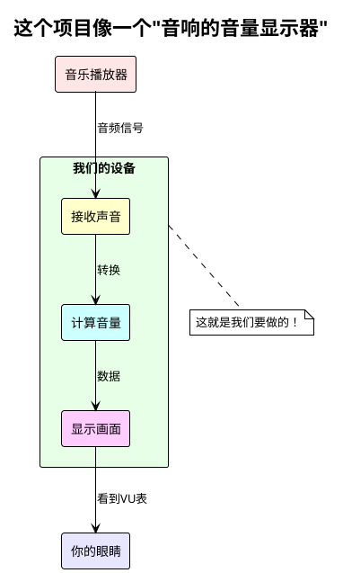

就像汽车仪表盘显示速度一样，我们的设备显示音量大小。

### 0.2 你将获得什么能力？

学完这个文档，你将能够：

1. **理解项目** - 知道每个部分在做什么
2. **沟通协作** - 能和硬件工程师有效交流  
3. **独立操作** - 会烧录、测试、排查问题
4. **项目交付** - 完整地把项目交给客户

### 0.3 学习地图

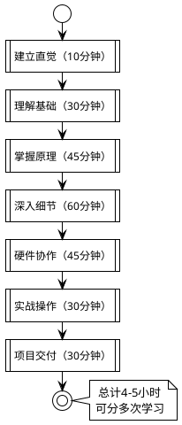

---

## 第1章：最小可理解系统

### 1.1 点亮一个LED - 建立信心

#### 什么是LED？

LED就是一个"电子灯泡"，给它电就亮，断电就灭。

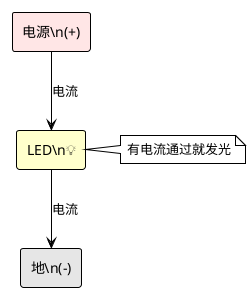

#### LED怎么连到单片机？

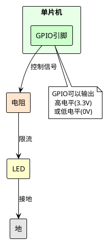

#### 控制LED的代码

```c
// 这是你见过的最简单的单片机代码！

// 点亮LED（假设低电平点亮）
HAL_GPIO_WritePin(LED_PORT, LED_PIN, GPIO_PIN_RESET);

// 熄灭LED  
HAL_GPIO_WritePin(LED_PORT, LED_PIN, GPIO_PIN_SET);

// 就这么简单！
```

🎯 **关键理解**：单片机通过改变引脚的电压（高/低）来控制外部设备。

### 1.2 从LED到单片机概念

#### LED为什么会亮？

让我们深入一点：

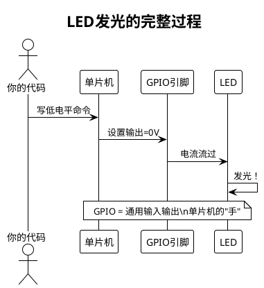

#### 什么是GPIO？

GPIO（General Purpose Input Output）是单片机与外界交流的"手"：

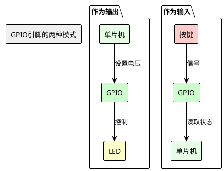

#### 什么是单片机？

单片机就是一个"微型电脑"：

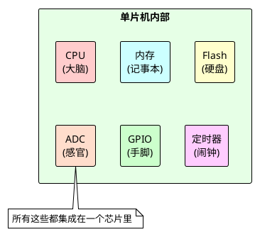

### 1.3 按键控制LED

现在让我们加入"输入"的概念：

#### 按键的原理

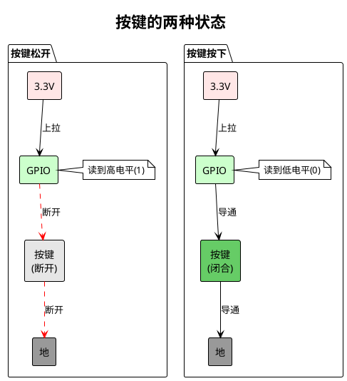

#### 按键控制LED的逻辑

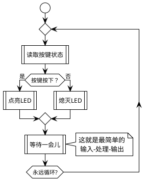

#### 对应的代码

```c
// 主循环中
while(1) {
    // 读取按键状态
    if(HAL_GPIO_ReadPin(KEY_PORT, KEY_PIN) == GPIO_PIN_RESET) {
        // 按键按下，点亮LED
        HAL_GPIO_WritePin(LED_PORT, LED_PIN, GPIO_PIN_RESET);
    } else {
        // 按键松开，熄灭LED
        HAL_GPIO_WritePin(LED_PORT, LED_PIN, GPIO_PIN_SET);
    }
}
```

🎯 **关键理解**：单片机不断循环检查输入，根据输入控制输出。这就是所有单片机程序的基础！

---

## 第2章：扩展到真实世界

### 2.1 从开关到模拟世界

#### 声音是什么？

之前我们处理的是开关（0或1），但声音是连续变化的：

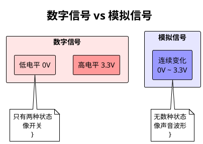

声音的波形是这样的：

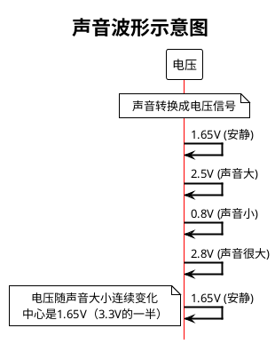

#### 为什么需要ADC？

单片机只能处理数字（0和1），所以需要ADC把模拟信号转换成数字：

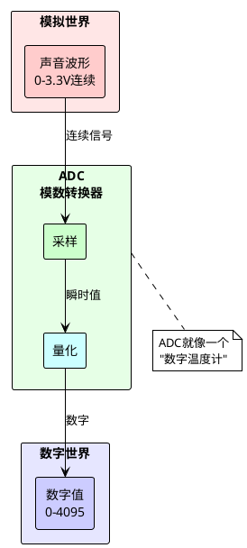

#### 采样的直觉理解

想象你在拍视频：
- 每秒30帧 = 每秒采样30次
- 帧数越高，视频越流畅
- 音频也一样，采样越快，还原越真实

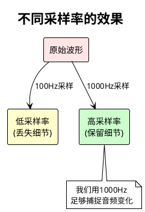

### 2.2 数字如何变成显示

#### 从LED到显示屏

LED只能显示亮/灭，但显示屏可以显示图像：

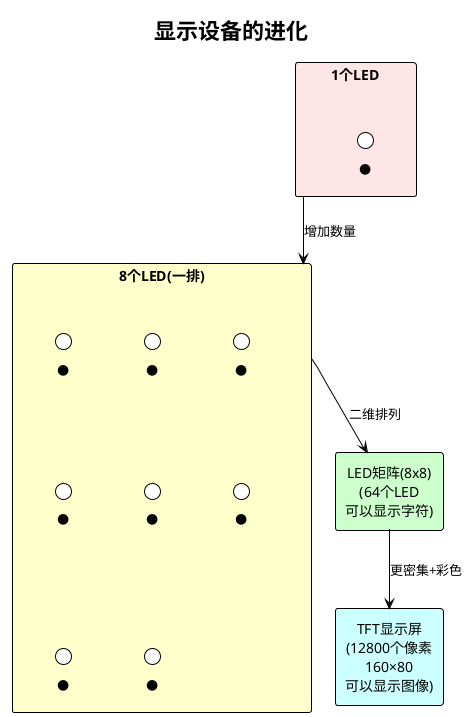

#### SPI通信的本质

控制这么多像素，不能每个都连一根线，所以需要"串行"通信：

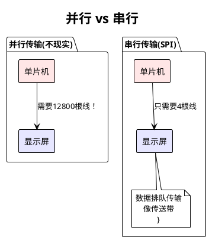

#### SPI的工作方式

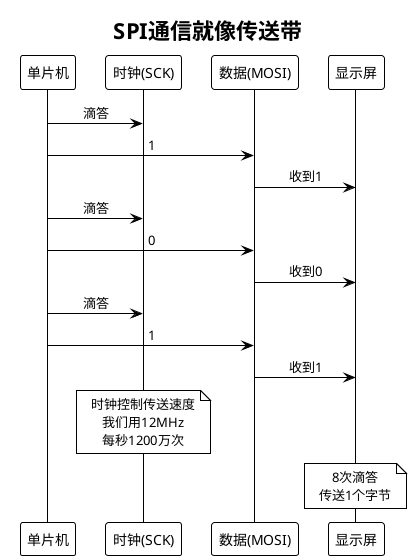

### 2.3 项目的全貌浮现

现在，让我们把所有部分连接起来：

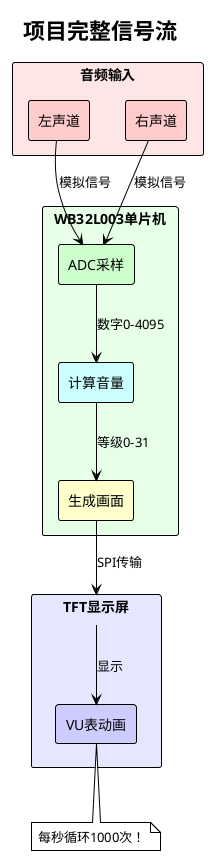

#### 时间关系

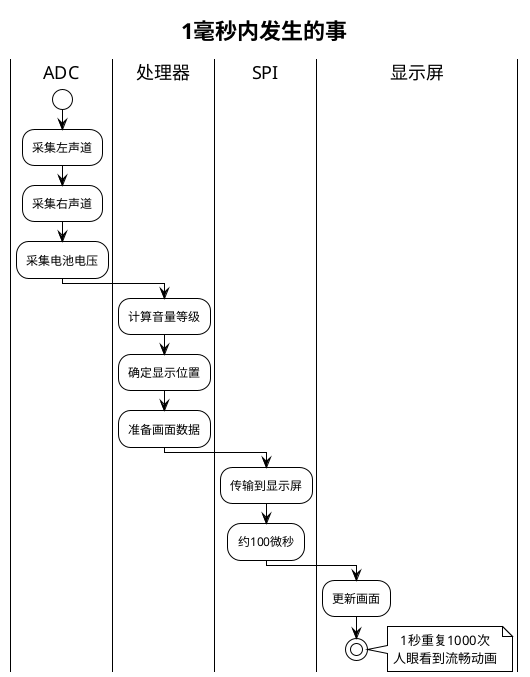

🎯 **关键理解**：
1. ADC把声音变成数字
2. CPU计算这些数字
3. SPI把结果送到屏幕
4. 快速重复形成动画

---

## 第3章：深入项目核心

### 3.1 VU表的工作原理

#### 什么是VU表？

VU（Volume Unit）表就是音量指示器，像这样：

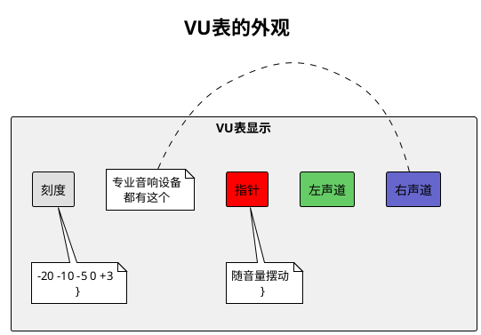

#### 音量如何变成位置？

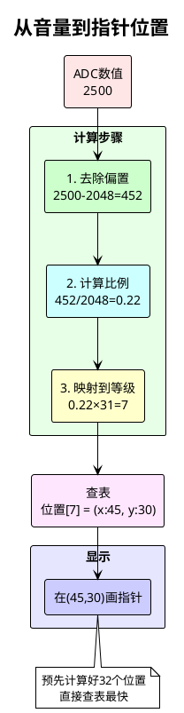

#### 动画的实现原理

```plantuml
@startuml
!theme plain
skinparam defaultTextAlignment center

title VU表动画原理

|时刻1|
:音量=5;
:在位置5画指针;

|时刻2|
:音量=8;
:擦除位置5;
:在位置8画指针;

|时刻3|
:音量=6;
:擦除位置8;
:在位置6画指针;

note right : 每秒50次\n形成流畅动画

@enduml
```

### 3.2 代码的层次结构

#### 为什么要分层？

就像盖房子，从地基到屋顶，每层有不同作用：

```plantuml
@startuml
!theme plain
skinparam defaultTextAlignment center

title 代码分层架构

rectangle "应用层" as app #FFE6E6 {
  rectangle "main.c\n主程序逻辑" as main #FFCCCC
  rectangle "ui.c\n界面显示" as ui #FFCCCC
}

rectangle "功能层" as func #E6FFE6 {
  rectangle "audio_adc.c\n音频处理" as audio #CCFFCC
  rectangle "power.c\n电源管理" as power #CCFFCC
  rectangle "hardware_control.c\n硬件控制" as hw #CCFFCC
}

rectangle "驱动层" as driver #E6E6FF {
  rectangle "st7735.c\n屏幕驱动" as lcd #CCCCFF
  rectangle "HAL库\n硬件抽象" as hal #CCCCFF
}

rectangle "硬件层" as hardware #F0F0F0 {
  rectangle "GPIO/SPI/ADC/TIM\n物理硬件" as phy #E0E0E0
}

app --> func : 调用功能
func --> driver : 使用驱动
driver --> hardware : 控制硬件

note right : 上层不需要知道\n下层的细节
@enduml
```

#### 每层的职责

```plantuml
@startuml
!theme plain
skinparam defaultTextAlignment center

package "应用层职责" {
  usecase "总体流程控制" as uc1
  usecase "用户交互响应" as uc2
  usecase "模式切换管理" as uc3
}

package "功能层职责" {
  usecase "音频数据采集处理" as uc4
  usecase "电池监测与保护" as uc5
  usecase "硬件状态控制" as uc6
}

package "驱动层职责" {
  usecase "屏幕像素操作" as uc7
  usecase "寄存器读写" as uc8
  usecase "时序控制" as uc9
}

note bottom : 每层只做自己的事\n接口清晰
@enduml
```

#### 模块间的协作

```plantuml
@startuml
!theme plain
skinparam defaultTextAlignment center
skinparam sequenceArrowThickness 2

title 一次完整的VU表更新

actor "主循环" as main
participant "音频模块" as audio
participant "UI模块" as ui
participant "显示驱动" as lcd

main -> audio : 请求音频数据
audio -> audio : ADC采样
audio -> audio : 计算等级
audio --> main : 返回等级值

main -> ui : 更新VU表(等级)
ui -> ui : 计算位置
ui -> ui : 生成图像
ui -> lcd : 发送图像数据

lcd -> lcd : SPI传输
lcd -> lcd : 更新屏幕

note over main : 50ms后重复
@enduml
```

### 3.3 关键技术深入

#### ADC的采样时机

```plantuml
@startuml
!theme plain
skinparam defaultTextAlignment center

title 定时器触发ADC

participant "定时器" as tim
participant "ADC" as adc
participant "DMA" as dma
database "缓冲区" as buf

== 每1ms ==
tim -> adc : 触发信号
adc -> adc : 采样左声道
adc -> adc : 采样右声道  
adc -> adc : 采样电池
adc -> dma : 传输数据
dma -> buf : 存储

== 缓冲区满 ==
buf -> buf : 32个采样
note over buf : 触发处理
@enduml
```

#### SPI的传输效率

```plantuml
@startuml
!theme plain
skinparam defaultTextAlignment center

title SPI传输时间计算

rectangle "传输需求\n160×80像素\n每像素2字节\n= 25600字节" as req #FFE6E6
rectangle "传输速度\n12MHz时钟\n每字节8个时钟\n= 1.5MB/秒" as speed #E6FFE6
rectangle "传输时间\n25600 ÷ 1500000\n= 17ms\n< 20ms刷新间隔" as time #E6E6FF
req --> time
speed --> time

note bottom : 所以能达到50Hz刷新率
@enduml
```

#### 电源管理策略

```plantuml
@startuml
!theme plain
skinparam defaultTextAlignment center

title 智能电源管理

start

repeat
  partition "活动检测" {
    :检查按键;
    :检查音频;
    if (有活动?) then (是)
      :重置计时器;
    else (否)
      :计时器+1;
    endif
  }
  
  partition "背光控制" {
    if (计时器 > 20秒?) then (是)
      :降低背光;
    endif
  }
  
  partition "深度睡眠" {
    if (计时器 > 10分钟?) then (是)
      :保存状态;
      :关闭外设;
      :进入睡眠;
      stop
    endif
  }
  
repeat while (系统运行中?)
@enduml
```

🎯 **关键理解**：
1. 分层让代码清晰可维护
2. 定时器保证采样准确
3. 优化让系统高效运行

---

## 第4章：硬件协作

### 4.1 看懂原理图

#### 电路符号速成

不需要成为硬件工程师，但要能看懂基本符号：

```plantuml
@startuml
!theme plain
skinparam defaultTextAlignment center

title 常见电路符号

package "基础元件" {
  rectangle "电阻\n〜〜〜" as r
  rectangle "电容\n-||-" as c
  rectangle "LED\n-▷|-" as led
  rectangle "按键\n-/ -" as key
}

package "连接符号" {
  rectangle "连接\n——•——" as conn
  rectangle "不连接\n——╱——" as noconn
  rectangle "地\n⊥" as gnd
  rectangle "电源\n▼VCC" as vcc
}

note bottom : 记住这些就够了
@enduml
```

#### 连线的含义

```plantuml
@startuml
!theme plain
skinparam defaultTextAlignment center

title 看懂连线

rectangle "MCU" as mcu #FFE6E6 {
  rectangle "PC5" as pc5
  rectangle "PC6" as pc6
}

rectangle "显示屏" as lcd #E6E6FF {
  rectangle "SCK" as sck
  rectangle "MOSI" as mosi
}

pc5 --> sck : 这条线传时钟
pc6 --> mosi : 这条线传数据

note bottom : 线上的标签告诉你\n信号的作用
@enduml
```

#### 关键参数识别

原理图上要注意的参数：

```plantuml
@startuml
!theme plain
skinparam defaultTextAlignment center

title 重要参数标注

rectangle "元件标注" as comp #FFE6E6 {
  rectangle "R1=10K\n(电阻值)" as r1
  rectangle "C1=100nF\n(电容值)" as c1
  rectangle "U1=WB32L003\n(芯片型号)" as u1
}

rectangle "电源标注" as power #E6FFE6 {
  rectangle "3.3V\n(工作电压)" as v33
  rectangle "VBAT\n(电池电压)" as vbat
}

rectangle "信号标注" as signal #E6E6FF {
  rectangle "SPI_SCK_12MHz\n(信号名+频率)" as sig
}

note bottom : 这些参数决定了\n代码中的配置
@enduml
```

### 4.2 引脚分配的艺术

#### 为什么这样分配？

引脚分配要考虑很多因素：

```plantuml
@startuml
!theme plain
skinparam defaultTextAlignment center

title 引脚分配的考虑因素

rectangle "功能需求\nSPI需要\n特定引脚" as func #FFE6E6
rectangle "电气特性\n高速信号\n要用HS引脚" as elec #E6FFE6
rectangle "PCB布线\n相关信号\n要靠近" as pcb #E6E6FF
rectangle "复用冲突\n避免功能\n冲突" as conf #FFFFCC
func --> "最终分配"
elec --> "最终分配"
pcb --> "最终分配"
conf --> "最终分配"

note bottom : 平衡各种因素\n得出最优方案
@enduml
```

#### 复用功能的权衡

同一个引脚可能有多种功能：

```plantuml
@startuml
!theme plain
skinparam defaultTextAlignment center

title 引脚复用示例

rectangle "PC5引脚" as pin #FFE6E6

rectangle "可选功能" as funcs #E6FFE6 {
  rectangle "GPIO" as gpio
  rectangle "SPI_SCK" as spi
  rectangle "TIM1_CH1" as tim
  rectangle "UART_TX" as uart
}

pin --> funcs

rectangle "我们选择" as choice #E6E6FF {
  rectangle "SPI_SCK\n(因为需要高速传输)" as selected #CCFFCC
}

funcs --> choice

note bottom : 一个引脚只能\n选一种功能
@enduml
```

#### 与PCB设计的关系

```plantuml
@startuml
!theme plain
skinparam defaultTextAlignment center

title 引脚分配影响PCB

package "好的分配" {
  rectangle "MCU" as mcu1 #FFE6E6
  rectangle "屏幕" as lcd1 #E6E6FF
  
  mcu1 --> lcd1 : SPI信号\n线路短、直
  note bottom : ✓ 信号质量好
}

package "差的分配" {
  rectangle "MCU" as mcu2 #FFE6E6
  rectangle "屏幕" as lcd2 #E6E6FF
  
  mcu2 --> lcd2 : SPI信号\n线路长、绕
  note bottom : ✗ 信号可能失真
}
@enduml
```

### 4.3 与硬件工程师对话

#### 必问的10个问题

```plantuml
@startuml
!theme plain
skinparam defaultTextAlignment left

title 硬件确认清单

rectangle "电源相关\n1. MCU供电是3.3V吗？\n2. 电池电压范围是多少？\n3. 需要去耦电容吗？" as power #FFE6E6

rectangle "接口相关\n4. SPI最高频率是多少？\n5. 需要上拉电阻的引脚？\n6. ADC参考电压是多少？" as interface #E6FFE6

rectangle "机械相关\n7. 按键有硬件消抖吗？\n8. 连接器型号是什么？\n9. 调试接口怎么引出？\n10. 散热需要考虑吗？" as mech #E6E6FF
@enduml
```

#### 常见分歧处理

```plantuml
@startuml
!theme plain
skinparam defaultTextAlignment center

title 软硬件分歧的解决

actor "软件" as sw
actor "硬件" as hw
participant "方案" as solution

== 案例1：引脚不够用 ==
sw -> hw : 我需要5个LED
hw -> sw : 只有3个空闲引脚
solution -> solution : 用串行转并行芯片

== 案例2：速度要求 ==
sw -> hw : SPI要20MHz
hw -> hw : PCB只能支持15MHz
solution -> solution : 优化代码减少数据量

== 案例3：功耗要求 ==
sw -> hw : 睡眠要<10μA
hw -> hw : 有个芯片漏电
solution -> solution : 增加电源开关

note over solution : 相互理解\n共同解决
@enduml
```

#### 文档交接要点

```plantuml
@startuml
!theme plain
skinparam defaultTextAlignment center

title 交付给硬件的文档

package "必需文档" {
  file "引脚定义表.xlsx" as pin
  file "电气参数.docx" as elec
  file "时序要求.pdf" as timing
}

package "详细内容" {
  rectangle "引脚定义表" as n1 #FFFFCC {
    rectangle "每个引脚的功能"
    rectangle "输入/输出方向"
    rectangle "上下拉配置"
  }
  
  rectangle "电气参数" as n2 #FFCCCC {
    rectangle "电压范围"
    rectangle "电流需求"
    rectangle "频率限制"
  }
  
  rectangle "时序要求" as n3 #CCFFCC {
    rectangle "建立时间"
    rectangle "保持时间"
    rectangle "时钟频率"
  }
}

pin --> n1
elec --> n2
timing --> n3
@enduml
```

🎯 **关键理解**：
1. 看懂原理图的基本符号即可
2. 引脚分配需要综合考虑
3. 沟通时用数据说话

---

## 第5章：实战烧录

### 5.1 烧录的本质

#### 程序如何进入芯片？

烧录就像"安装软件"到单片机：

```plantuml
@startuml
!theme plain
skinparam defaultTextAlignment center

title 烧录过程解析

rectangle "你的电脑" as pc #FFE6E6 {
  file "firmware.bin" as fw
  note bottom : 编译好的程序\n}

rectangle "烧录器\n(ST-Link)\nUSB转SWD" as prog #E6FFE6
rectangle "单片机" as mcu #E6E6FF {
  rectangle "Flash存储器" as flash #CCCCFF
  note bottom : 程序存在这里\n}

fw --> prog : USB传输
prog --> flash : SWD协议写入

note right of flash : Flash就像\n单片机的硬盘
@enduml
```

#### SWD接口解密

SWD只需要2根数据线：

```plantuml
@startuml
!theme plain
skinparam defaultTextAlignment center

title SWD接口原理

rectangle "ST-Link" as stlink #FFE6E6
rectangle "单片机" as mcu #E6E6FF

stlink --> mcu : SWDIO (数据)
stlink --> mcu : SWDCLK (时钟)
stlink --> mcu : GND (地)
stlink --> mcu : 3.3V (可选)

note bottom : 就像简化版的\nUSB接口
@enduml
```

#### 烧录过程的细节

```plantuml
@startuml
!theme plain
skinparam defaultTextAlignment center

title 烧录的完整流程

start

:连接硬件;
note right : ST-Link → 目标板

:识别芯片;
note right : 读取芯片ID

:擦除Flash;
note right : 清空旧程序

:写入新程序;
note right : 一页一页写入

:校验数据;
note right : 确保写入正确

:复位运行;
note right : 开始执行新程序

stop

note left : 整个过程\n约5-10秒
@enduml
```

### 5.2 第一次烧录

#### 连接步骤图解

```plantuml
@startuml
!theme plain
skinparam defaultTextAlignment center

title 硬件连接步骤

|步骤1|
:准备材料;
note right
  - ST-Link V2
  - 杜邦线4根
  - 目标板
  - USB线
end note

|步骤2|
:连接电源;
note right
  红线: 3.3V → VDD
  黑线: GND → GND
end note

|步骤3|
:连接数据;
note right
  绿线: SWDIO → PC7
  黄线: SWDCLK → PD1
end note

|步骤4|
:连接电脑;
note right : ST-Link → USB

|完成|
:检查连接;
note right : LED指示灯亮
@enduml
```

#### 烧录命令详解

Windows系统：
```bash
# 检查连接
st-info --probe
# 输出: Found 1 stlink programmers

# 烧录程序
st-flash write firmware.bin 0x08000000
# 输出: Flash written and verified!
```

Mac/Linux系统：
```bash
# 安装工具
brew install stlink        # Mac
sudo apt install stlink-tools  # Linux

# 烧录步骤相同
st-flash write firmware.bin 0x08000000
```

#### 成功标志

```plantuml
@startuml
!theme plain
skinparam defaultTextAlignment center

title 烧录成功的标志

start

:烧录完成;

if (看到"verified"?) then (是)
  :检查屏幕;
  if (显示开机画面?) then (是)
    #palegreen:烧录成功！;
  else (否)
    #pink:检查显示连接;
  endif
else (否)
  #pink:烧录失败;
  :检查连接;
  :重试;
endif

stop
@enduml
```

### 5.3 调试技巧

#### 如何判断问题？

```plantuml
@startuml
!theme plain
skinparam defaultTextAlignment center

title 问题定位流程图

start

:设备不工作;

if (电源LED亮?) then (否)
  #pink:电源问题;
  :检查供电;
  stop
else (是)
  if (能识别芯片?) then (否)
    #pink:连接问题;
    :检查SWD连接;
    stop
  else (是)
    if (烧录成功?) then (否)
      #pink:Flash问题;
      :尝试擦除重烧;
      stop
    else (是)
      if (程序运行?) then (否)
        #pink:程序问题;
        :检查代码;
        stop
      else (是)
        #palegreen:硬件问题;
        :检查外设;
      endif
    endif
  endif
endif

stop
@enduml
```

#### 常见错误排查

```plantuml
@startuml
!theme plain
skinparam defaultTextAlignment center

title 错误信息对照表

map "错误信息 → 解决方法" as ErrorMap {
  "Unknown chip id" => 检查电源和连接
  "Flash locked" => 先执行解锁命令
  "Verification failed" => 重新烧录
  "No device found" => 检查USB驱动
  "Write error" => 检查Flash容量
}
@enduml
```

#### 调试工具使用

串口调试输出：
```c
// 在代码中添加调试信息
printf("ADC value: %d\n", adc_value);
printf("Level: %d\n", level);

// 通过串口查看
// 波特率: 115200
// 数据位: 8
// 停止位: 1
// 校验: 无
```

🎯 **关键理解**：
1. 烧录就是把程序写入Flash
2. SWD接口简单可靠
3. 调试要有系统方法

---

## 第6章：项目交付

### 6.1 功能验证清单

#### 逐项测试方法

```plantuml
@startuml
!theme plain
skinparam defaultTextAlignment center

title 功能测试流程

package "基础功能" #FFE6E6 {
  usecase "开机测试" as t1
  usecase "按键响应" as t2
  usecase "LED指示" as t3
}

package "核心功能" #E6FFE6 {
  usecase "音频显示" as t4
  usecase "模式切换" as t5
  usecase "背光调节" as t6
}

package "保护功能" #E6E6FF {
  usecase "低电警告" as t7
  usecase "自动关机" as t8
  usecase "异常恢复" as t9
}

note bottom : 按顺序测试\n记录结果
@enduml
```

#### 性能指标确认

```plantuml
@startuml
!theme plain
skinparam defaultTextAlignment left

title 性能指标检查表

rectangle "显示性能\n□ 刷新率 ≥ 50Hz\n□ 无闪烁\n□ 无拖影" as display

rectangle "音频性能\n□ 采样率 = 1kHz\n□ 响应灵敏\n□ 左右同步" as audio

rectangle "功耗指标\n□ 运行 < 50mA\n□ 待机 < 100μA\n□ 电池续航 > 10小时" as power
@enduml
```

#### 问题记录模板

```
测试记录表
日期: 2025-01-02
测试人: ___________

| 测试项 | 预期结果 | 实际结果 | 通过 | 备注 |
|--------|----------|----------|------|------|
| 开机   | 显示logo | 显示正常 | ✓    |      |
| 音频   | VU表动   | 左偏小   | ✗    | 需校准|
| ...    | ...      | ...      | ...  | ...  |

问题汇总:
1. 左声道灵敏度偏低
   - 原因: ADC通道配置错误
   - 解决: 修改通道号
```

### 6.2 文档准备

#### 交付文档清单

```plantuml
@startuml
!theme plain
skinparam defaultTextAlignment center

title 项目交付文档

package "技术文档" {
  file "硬件原理图" as sch
  file "PCB文件" as pcb
  file "BOM清单" as bom
  file "固件源码" as src
}

package "用户文档" {
  file "使用说明书" as manual
  file "快速指南" as quick
  file "故障排查" as trouble
}

package "测试报告" {
  file "功能测试" as func
  file "性能测试" as perf
  file "可靠性测试" as rel
}

note bottom : 完整交付\n便于维护
@enduml
```

#### 关键信息提取

重要参数汇总表：
```
项目: WB32L003耳放VU表
版本: v2.0.0
日期: 2025-01-02

硬件配置:
- MCU: WB32L003 (64KB/4KB)
- 显示: 0.96" TFT 160×80
- 接口: SPI 12MHz
- 电源: 3.7V锂电池

软件特性:
- 采样率: 1kHz
- 刷新率: 50Hz
- 功耗: <50mA(运行) <100μA(待机)

引脚使用率: 18/32 (56%)
Flash使用率: 32KB/64KB (50%)
RAM使用率: 2.5KB/4KB (62%)
```

#### 后续维护说明

```plantuml
@startuml
!theme plain
skinparam defaultTextAlignment center

title 维护指南结构

rectangle "日常维护\n固件更新方法\n参数调整说明" as daily #FFE6E6
rectangle "故障处理\n常见问题\n排查步骤" as fault #E6FFE6
rectangle "功能扩展\n预留接口\n升级路径" as extend #E6E6FF
daily --> "维护手册"
fault --> "维护手册"
extend --> "维护手册"
@enduml
```

### 6.3 知识内化

#### 你学到了什么？

```plantuml
@startuml
!theme plain
skinparam defaultTextAlignment center

title 知识体系总结

rectangle "基础概念\n• 单片机原理\n• GPIO输入输出\n• ADC模数转换\n• SPI通信协议" as basic #FFE6E6

rectangle "项目技能\n• 看懂原理图\n• 理解代码架构\n• 硬件调试方法\n• 性能优化技巧" as project #E6FFE6

rectangle "协作能力\n• 技术文档编写\n• 问题沟通技巧\n• 测试流程规范\n• 项目交付标准" as team #E6E6FF

basic --> "完整能力"
project --> "完整能力"
team --> "完整能力"
@enduml
```

#### 可以做什么？

现在你可以：

1. **独立部署项目**
   - 烧录固件
   - 测试功能
   - 排查问题

2. **参与技术讨论**
   - 理解硬件限制
   - 提出优化建议
   - 评估可行性

3. **管理类似项目**
   - 把控进度
   - 协调资源
   - 确保质量

#### 下一步方向

```plantuml
@startuml
!theme plain
skinparam defaultTextAlignment center

title 继续学习路线图

start

:当前位置;
note right : 掌握了一个\n完整项目

if (想深入技术?) then (是)
  :学习RTOS;
  :研究驱动开发;
  :优化算法;
else (否)
  if (想做项目管理?) then (是)
    :学习更多硬件知识;
    :掌握测试方法;
    :提升沟通技巧;
  else (否)
    :做更多项目;
    :积累经验;
    :形成方法论;
  endif
endif

:成为专家;

stop
@enduml
```

---

## 结语

恭喜你完成了这段学习之旅！

回顾一下你的成长：
- 从不知道GPIO是什么 → 能独立烧录调试
- 从看不懂原理图 → 能与硬件工程师对话
- 从害怕单片机 → 能完整交付项目

记住这些原则：
1. **循序渐进** - 不要跳跃学习
2. **理论实践结合** - 学了就试
3. **保持好奇** - 多问为什么
4. **注重积累** - 建立自己的知识库

最后的建议：
- 保存这份文档，它是你的参考手册
- 实际操作一遍，加深理解
- 遇到问题时回来查阅
- 分享给需要的朋友

祝你在嵌入式开发的道路上越走越远！🚀

---

*本文档遵循认知心理学原理设计，确保最优学习体验*
*如有疑问，欢迎随时提问*